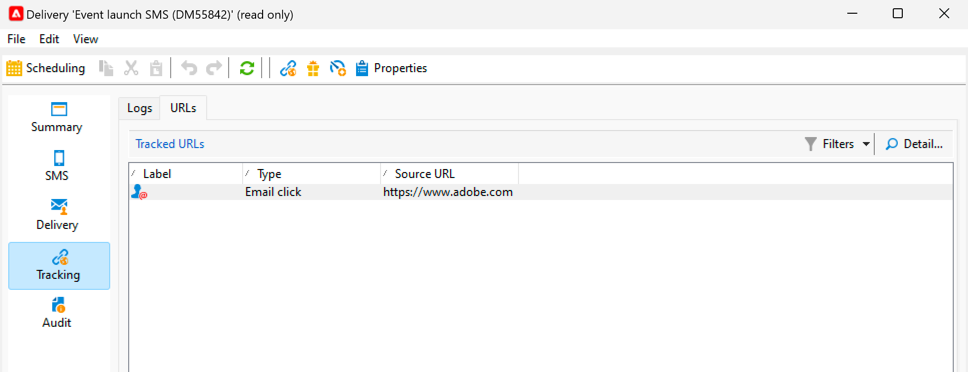

# Een SMS bijhouden

Het is belangrijk om u te controleren de levering van SMS, om ervoor te zorgen dat uw marketing campagnes efficiënt zijn.

Hier de mogelijkheden u moet weten wat na de verzending van uw levering gebeurt

## Begrijp het de leveringsdashboard van SMS

Het leveringsdashboard geeft u veel informatie over uw SMS.

Om tot het dashboard toegang te hebben, klik op uw levering in de leveringslijst tweemaal.

Op het tabblad **[!UICONTROL Summary]** staan de belangrijkste gegevens zoals het aantal verwerkte berichten en het aantal geslaagde pogingen.

{zoomable="yes"}

Na het verzenden van SMS is het tabblad **[!UICONTROL SMS]** , dat over de inhoud van de levering gaat, niet meer toegankelijk voor een wijziging.

Op het tabblad **[!UICONTROL Delivery]** vindt u de informatie over de leveringslogboeken. Voor elk gecontacteerd adres, kunt u zien of is SMS verzonden of niet

{zoomable="yes"}

U kunt op het tabblad **[!UICONTROL Exclusions]** de details zien over waarom sommige adressen van het doel zijn uitgesloten.

{zoomable="yes"}

Het tabblad **[!UICONTROL Tracking]** gaat over het bijhouden van gegevens. Onder het voorbeeld van een URL die in de inhoud van SMS wordt gevolgd.

{zoomable="yes"}

En tot slot het tabblad **[!UICONTROL Audit]** met alle details tijdens het starten van de levering:

{zoomable="yes"}

## SMS-fouten begrijpen

De fouttypen en de redenen voor een mislukking voor SMS zijn gelijk aan die voor e-mailberichten.

Leer meer over [ leveringsmislukkingen ](../delivery-failures.md) en specifiek over [ SMS quarantines ](../delivery-failures.md#sms-quarantines).

