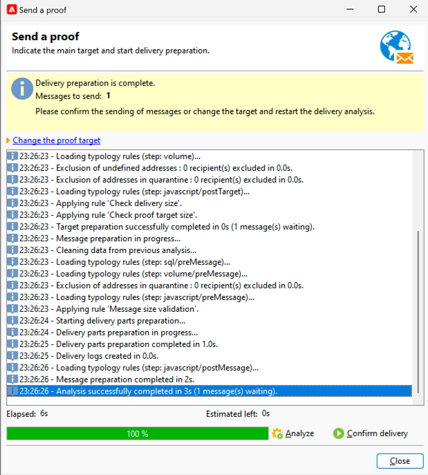

# Een bewijs van een SMS-levering verzenden {#sms-proof}

Adobe raadt u ten zeerste aan een validatiecyclus voor levering in te stellen. Zorg ervoor dat de inhoud is goedgekeurd voordat u deze naar het publiek stuurt.

Je kunt een bewijs voor je SMS-levering verzenden om het te valideren:

1. Klik op de knop **[!UICONTROL Send a proof]** . Er wordt een venster geopend

   {zoomable="yes"}

   U hebt meerdere modi om een proef te verzenden:

   * **[!UICONTROL Definition of a specific proof target]**: hiermee kunt u met filters zoeken naar de adressen in de database als het proefdrukdoel
   * **[!UICONTROL Substitution of the address]**: hiermee kunt u uw testadressen invoeren en de gegevens van de doelontvanger gebruiken om de inhoud te valideren. U kunt de vervangende adressen handmatig invoeren of selecteren in de vervolgkeuzelijst. De gekoppelde opsomming is **[!UICONTROL Substitution address (rcpAddress)]** .
Standaard wordt vervanging willekeurig uitgevoerd, maar u kunt een specifieke ontvanger selecteren in het hoofddoel via het pictogram **[!UICONTROL Detail]** .
   * **[!UICONTROL Seed addresses]**: hiermee hebt u toegang tot zaadadressen als proefdoel. Deze adressen kunnen uit een dossier worden ingevoerd of manueel ingegaan.
   * **[!UICONTROL Specific target and Seed addresses]**: hiermee kunt u zaadadressen en adressen van ontvangers combineren.

1. Nadat u **[!UICONTROL Targeting mode]** hebt gekozen, voegt u de proefdrukadressen volgens deze optie toe

   In het onderstaande voorbeeld kiezen we **[!UICONTROL Definition of a specific proof target]** en voegen we een ontvanger toe:

   {zoomable="yes"}

1. Klik op de knop **[!UICONTROL Analyze]** .
Adobe Campaign voert alle controle uit alvorens de verzending van bewijs te bevestigen. Aan het einde van de analyse kan op de knop **[!UICONTROL Confirm delivery]** worden geklikt.

   {zoomable="yes"}

1. Klik op **[!UICONTROL Confirm delivery]** om de proefdruk van uw SMS-levering te verzenden.

Als allen op dit stadium juist is, kunt u vooruit gaan en [ uw levering van SMS verzenden naar het publiek ](sms-audience.md).
