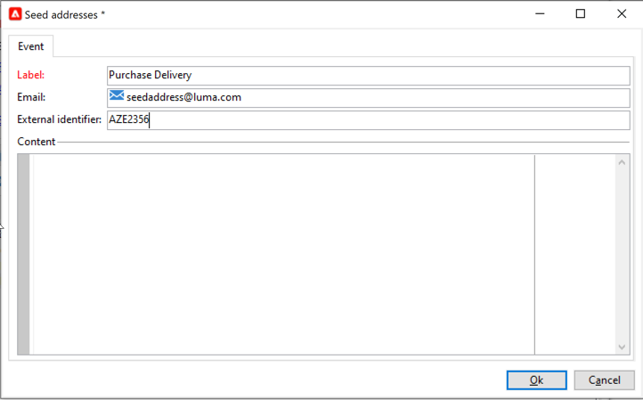
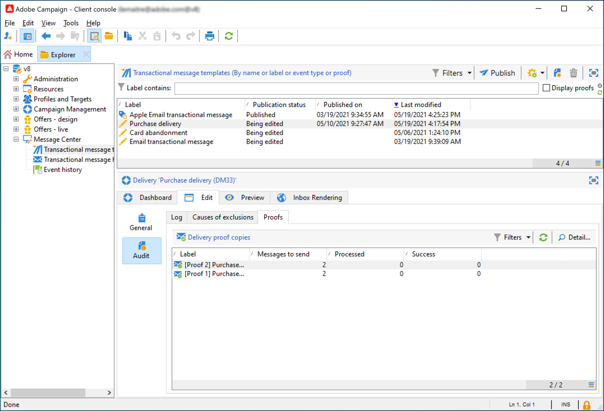

# Creeer en publiceer uw malplaatje voor Transactieoverseinen{#template-transactional-messages}

Elke gebeurtenis kan een gepersonaliseerd bericht teweegbrengen. Hiervoor moet u een berichtsjabloon maken die overeenkomt met elk gebeurtenistype. De malplaatjes bevatten de noodzakelijke informatie voor het personaliseren van het transactiebericht. U kunt malplaatjes ook gebruiken om de berichtvoorproef te testen en proeven te verzenden gebruikend zaadadressen alvorens aan het definitieve doel te leveren.

## De sjabloon maken{#create-message-template}

Volg onderstaande stappen om een berichtsjabloon te maken:

1. Ga naar de **[!UICONTROL Message Center >Transactional message templates]** in de Adobe Campaign-structuur.
1. Klik in de lijst met transactiemalesjablonen met de rechtermuisknop en selecteer **[!UICONTROL New]** in het vervolgkeuzemenu of klik op de knop **[!UICONTROL New]** boven de lijst met transactiemalusjablonen voor berichten.

   

1. Selecteer in het leveringsvenster de leveringssjabloon die geschikt is voor het kanaal dat u wilt gebruiken.

   

1. Wijzig indien nodig het label.
1. Selecteer het type gebeurtenis dat overeenkomt met het bericht dat u wilt verzenden. Gebeurtenistypen die bestemd zijn om door Adobe Campaign te worden verwerkt, moeten vooraf worden gemaakt. [Meer informatie](#create-event-types)

   

   >[!CAUTION]
   >
   >Een gebeurtenistype mag nooit aan meerdere sjablonen worden gekoppeld.

1. Voer een aard en beschrijving in en klik vervolgens op **[!UICONTROL Continue]** om de berichttekst te maken.

## De inhoud maken{#create-message-content}

De definitie van de inhoud van het transactiebericht is hetzelfde als voor alle leveringen in Adobe Campaign. Voor een e-maillevering kunt u bijvoorbeeld inhoud in HTML- of tekstindeling maken, bijlagen toevoegen of het bezorgingsobject aanpassen. [Meer informatie](../start/create-message.md).

>[!CAUTION]
>
>Afbeeldingen in het bericht moeten openbaar toegankelijk zijn. Adobe Campaign biedt geen mechanisme voor het uploaden van afbeeldingen voor transactieberichten.\
>In tegenstelling tot JSSP of webApp, `<%=` heeft geen standaardescaping.
>
>U moet alle gegevens die uit de gebeurtenis komen, op de juiste wijze verwijderen. Deze escape is afhankelijk van de manier waarop dit veld wordt gebruikt. Gebruik in een URL bijvoorbeeld encodeURIComponent. U kunt escapeXMLString gebruiken om in de HTML te worden weergegeven.

Zodra u uw berichtinhoud hebt bepaald, kunt u gebeurtenisinformatie in het berichtlichaam integreren en het personaliseren. Gebeurtenisgegevens worden via personalisatietags in de tekst ingevoegd.

* Alle verpersoonlijkingsgebieden komen van de lading.
* Het is mogelijk om één of verscheidene verpersoonlijkingsblokken in een transactiebericht van verwijzingen te voorzien. <!--The block content will be added to the delivery content during the publication to the execution instance.-->

Voer de volgende stappen uit om personalisatietags in te voegen in de tekst van een e-mailbericht:

1. Klik in de berichtsjabloon op het tabblad dat overeenkomt met de e-mailindeling (HTML of tekst).
1. Voer de tekst van het bericht in.
1. Voeg in de tekst de tag in met behulp van de **[!UICONTROL Real time events>Event XML]** menu&#39;s.

   

1. Vul de tag in met de volgende syntaxis: **elementnaam**.@**kenmerknaam** zoals hieronder weergegeven.

   

## Test het transactiemalplaatje van het berichtbericht {#test-message-template}

### Seedadressen toevoegen{#add-seeds}

Een zaadadres laat u een voorproef van uw bericht tonen, een proef, en de personalisatie van het testbericht verzenden alvorens het bericht te verzenden. De zaadadressen zijn verbonden met de levering en kunnen niet voor andere leveringen worden gebruikt.

1. Klik in de sjabloon Transactiebericht op de knop **[!UICONTROL Seed addresses]** en klikt u op de knop **[!UICONTROL Add]** knop.

   

1. Wijs er later een label aan toe voor een eenvoudige selectie en voer vervolgens het beginadres in (afhankelijk van het communicatiekanaal via e-mail of mobiele telefoon).

1. Voer de externe id in: in dit optionele veld kunt u een zakelijke sleutel invoeren (unieke id, naam + e-mail, enz.) Deze instelling geldt voor alle toepassingen op uw website die worden gebruikt om uw profielen te identificeren. Als dit veld ook aanwezig is in de Adobe Campaign-marketingdatabase, kunt u een gebeurtenis vervolgens afstemmen op een profiel in de database.

   

1. Voeg testgegevens in. Zie [deze sectie](#personalization-data).

   

1. Klikken **[!UICONTROL Ok]** ter bevestiging van de oprichting van het zaadadres.

1. Herhaal dit proces om zoveel adressen te maken als u nodig hebt.

   

Zodra de adressen worden gecreeerd, kunt u tot hun voorproef en verpersoonlijking toegang hebben.

<!--

### Add personalization data{#personalization-data}

You can add data in the message template to test transactional message personalization. This will allow you to generate a preview or send a proof. If you install the **Deliverability** module, this data allows you to display a rendering of the messages for various desktop, web or mobile clients.

The purpose of this data is to test your messages before their final delivery. These messages do not coincide with actual data to be processed by Message Center.

However, the XML structure must be identical to that of the event stored in the execution instance, as shown below. 

This information enables you to personalize message content using personalization tags.

1. In the message template, click the **[!UICONTROL Seed addresses]** tab.
1. In the event content, enter the test information in XML format.

   
-->

### Je transactiebericht bekijken{#transactional-message-preview}

Zodra u één of meerdere zaadadressen en het berichtlichaam hebt gecreeerd, kunt u voorproef het bericht en zijn verpersoonlijking controleren.

1. Klik in de berichtsjabloon op de knop **[!UICONTROL Preview]** tab, dan selecteren **[!UICONTROL A seed address]** in de vervolgkeuzelijst.

   

1. Selecteer het zaadadres eerder wordt gecreeerd om het gepersonaliseerde bericht te tonen dat.

   

### Een proef verzenden {#send-proof}

U kunt berichtlevering testen door een bewijs naar een eerder gecreeerd zaadadres te verzenden.

Bij het verzenden van een bewijs wordt hetzelfde proces gebruikt als bij elke levering.

Meer informatie over proefdrukken in [deze sectie](../send/preview-and-proof.md#proofs-send).

Als u echter een bewijs van een transactiebericht wilt verzenden, moet u de volgende bewerkingen uitvoeren:

* Een of meer maken [zaadadressen](#add-seeds) met gegevens van een personalisatietest
* Berichtinhoud maken

Het bewijs verzenden:

1. Klik op de knop **[!UICONTROL Send a proof]** in het leveringsvenster.
1. Analyseer de levering.
1. Corrigeer eventuele fouten en bevestig de levering.

   

1. Controleer of het bericht aan het zaadadres is bezorgd en of de inhoud ervan aan uw configuratie voldoet.

   

In elke sjabloon zijn proefdrukken toegankelijk via de **[!UICONTROL Audit]** tab.

#### Overgang van [!DNL Campaign Classic] v7 {#transition-from-v7}

Als u [overstappen van Campaign Classic v7](../start/v7-to-v8.md), alle leveringen worden uitgevoerd via de server voor midsourcing.

Nochtans, wanneer het creëren van een transactionele berichtmalplaatje, wordt het verpletteren nodig voor het met succes te gebruiken malplaatje **interne e-maillevering**. Dit het verpletteren verhindert u proefdrukken te verzenden.

Daarom moet u, om een bewijs voor u transactionele berichtmalplaatje te verzenden, het verpletteren van interne e-maillevering aan veranderen **mid-sourcing die rekening verplettert**.

Zodra de proefdrukken zijn verzonden, moet u het verpletteren terug naar interne e-maillevering veranderen alvorens het transactionele berichtmalplaatje te publiceren.

## De sjabloon publiceren {#publish-message-template}

Als de berichtsjabloon is gemaakt<!-- on the control instance--> is voltooid, kunt u het publiceren, waardoor u berichten kunt verzenden die zijn gekoppeld aan realtime- en batchgebeurtenissen.

<!--This process will also publish it on all execution instances.

NOTE: When publishing transactional message templates, typology rules are also automatically published on the execution instances.

Publication lets you automatically create two message templates on the execution instances, which will allow you to send messages linked to real-time and batch events.-->

>[!CAUTION]
>
>Wanneer u om het even welke veranderingen in een malplaatje aanbrengt, zorg ervoor u het voor deze veranderingen opnieuw publiceert om tijdens de levering van het transactiemelding van berichten effectief te zijn.

1. Ga naar de **[!UICONTROL Message Center > Transactional message templates]** map van de structuur.
1. Selecteer de sjabloon die u wilt publiceren<!--on your execution instances-->.
1. Klik op **[!UICONTROL Publish]**.

   

Wanneer de publicatie is voltooid, worden zowel berichtsjablonen die moeten worden toegepast op batch- als real-time-type-gebeurtenissen gemaakt in het dialoogvenster **[!UICONTROL Administration > Production > Message Center Execution> Default > Transactional message templates]** map.

Als een sjabloon eenmaal is gepubliceerd en de bijbehorende gebeurtenis wordt geactiveerd, Adobe Campaign<!--execution instance--> ontvangt de gebeurtenis, koppelt deze aan de transactiesjabloon en stuurt het bijbehorende transactiemelding naar elke ontvanger.

<!--
>[!NOTE]
>
>If you replace an existing field of the transactional message template, such as the sender address, with an empty value, the corresponding field on the execution instance(s) will not be updated once the transactional message is published again. It will still contain the previous value.
>
>However, if you add a non-empty value, the corresponding field will be updated as usual after the next publication.
-->

## Publicatie van een sjabloon ongedaan maken

Zodra een berichtmalplaatje wordt gepubliceerd <!--on the execution instances-->, kan de publicatie ongedaan worden gemaakt.

* Een gepubliceerde sjabloon kan zelfs nog steeds worden aangeroepen als de bijbehorende gebeurtenis wordt geactiveerd: als u geen berichtsjabloon meer gebruikt, wordt aangeraden de publicatie ongedaan te maken. Dit om te voorkomen dat er per ongeluk een ongewenste transactiemelding wordt verzonden.

  U hebt bijvoorbeeld een berichtsjabloon gepubliceerd die u alleen gebruikt voor kerstcampagnes. Misschien wilt u de publicatie ongedaan maken nadat de kerstperiode is afgelopen en deze volgend jaar opnieuw publiceren.

* U kunt ook geen transactiemalplaatje verwijderen dat de **[!UICONTROL Published]** status. U moet eerst de publicatie ongedaan maken.

Volg onderstaande stappen om de publicatie van een transactiemalplaatje ongedaan te maken.

1. Bladeren naar de **[!UICONTROL Message Center > Transactional message templates]** map.
1. Selecteer de sjabloon die u wilt verwijderen.
1. Klik op **[!UICONTROL Unpublish]**.
1. Klik op **[!UICONTROL Start]**.

De status van de transactiemalplaatje verandert terug van **[!UICONTROL Published]** tot **[!UICONTROL Being edited]**.

Zodra de publicatie is voltooid:

* Beide berichtmalplaatjes (die op partij en in real time typegebeurtenissen worden toegepast) worden geschrapt<!-- from each execution instance-->.

  Ze verschijnen niet meer in het dialoogvenster **[!UICONTROL Administration > Production > Message Center Execution > Default > Transactional message templates]** map.

* Nadat een sjabloon niet is gepubliceerd, kunt u deze verwijderen<!-- from the control instance-->.

  Selecteer dit in de lijst en klik op de knop **[!UICONTROL Delete]** op de rechterbovenhoek van het scherm.
