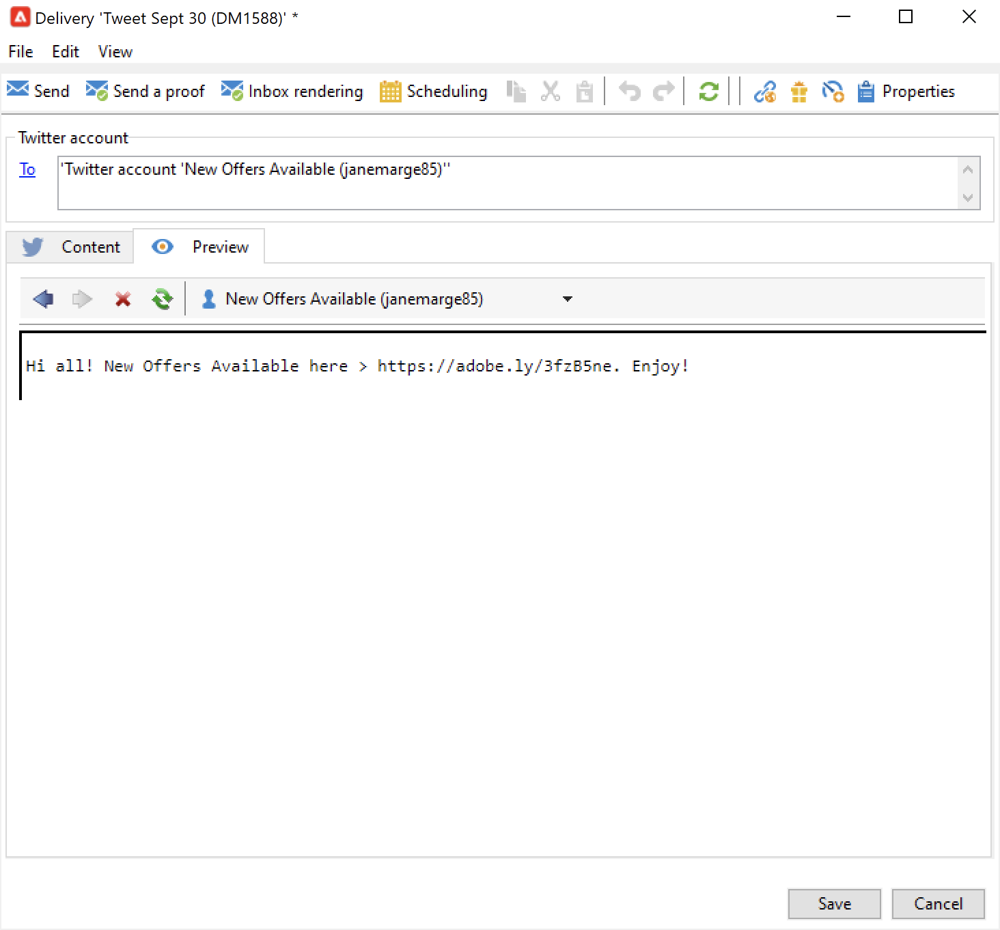

# Berichten publiceren op X (Twitter) met Adobe Campaign {#post-tw-messages}

Adobe Campaign komt met de module van de a **Sociale Marketing** die u met uw klanten en vooruitzichten via X (vroeger die als Twitter wordt bekend) laat in wisselwerking staan.

Zodra de integratie wordt gevormd, kunt u:

* Verzend directe berichten naar uw volgers
* Plaatsen op uw X-account
* Verzamel nieuwe contacten door de profielgegevens terug te krijgen, die u toelaat om het richten campagnes uit te voeren en, waar mogelijk, om kanaalstrategieën uit te voeren. Voor deze handeling is toestemming van de gebruiker vereist.

De stappen van de configuratie om uw rekening van X met Adobe Campaign te integreren worden beschreven in [&#x200B; deze pagina &#x200B;](../connect/ac-tw.md).

## Een X-bericht maken en publiceren {#publish-on-tw}

Voer de onderstaande stappen uit om een bericht op uw X-account te plaatsen:

1. Een X-levering maken

   Maak een nieuwe levering op basis van de leveringssjabloon van **[!UICONTROL Tweet (twitter)]** .

   

1. Selecteer het hoofddoel

   Selecteer de account(s) waarnaar je berichten wilt verzenden.

   

   1. Klik op de koppeling **[!UICONTROL To]**.
   1. Klik op de knop **[!UICONTROL Add]**.
   1. Selecteer **[!UICONTROL A Twitter account]**.
   1. Selecteer in het veld **[!UICONTROL Folder]** de servicemap die de X-account bevat. Selecteer vervolgens de X-account waarnaar u de tweet wilt verzenden.

1. Proofingdoel selecteren

   Op het tabblad **[!UICONTROL Target of the proofs]** kunt u de X-account definiëren die voor testleveringen moet worden gebruikt voordat de levering wordt voltooid.

   Zoals gedetailleerd in de [&#x200B; configuratiestappen &#x200B;](../connect/ac-tw.md#tw-test-account), moet u een privé testX rekening tot stand brengen gewijd aan het verzenden van proeven.

   >[!NOTE]
   >
   >Als u voor al uw leveringen dezelfde X-testaccount gebruikt, kunt u het proefdrukdoel opslaan in de **[!UICONTROL Tweet]** -leveringssjabloon, geopend via het **[!UICONTROL Resources > Templates > Delivery templates]** -knooppunt. Het proefdrukdoel wordt dan standaard ingevoerd voor elke nieuwe levering.

1. De inhoud van je bericht definiëren

   Voer de inhoud van de advertentie in op het tabblad **[!UICONTROL Content]** .

   

   >[!CAUTION]
   >
   >Bij het plaatsen op X gelden de beperkingen:
   >
   >* Het bericht mag niet langer zijn dan 140 tekens.
   >* HTML-indeling wordt niet ondersteund.
   >

1. Je advertentie bekijken

   Blader naar het tabblad **[!UICONTROL Preview]** om de weergave van uw advertentie te controleren.

   

   1. Klik op de tab **[!UICONTROL Preview]** .
   1. Klik op de vervolgkeuzelijst **[!UICONTROL Test personalization]** en selecteer **[!UICONTROL Service]** .
   1. Selecteer in het veld **[!UICONTROL Folder]** de servicemap die uw X-account bevat.

1. Een proef verzenden

   Voordat u uw tweet publiceert, moet u controleren of de publicatie is gevalideerd door een bewijs van uw publicatie te verzenden. U kunt dan een exacte weergave van de publicatie op een persoonlijke X-testpagina krijgen.

1. Bericht verzenden

   1. Klik op de knop **[!UICONTROL Send]** als de inhoud is goedgekeurd.
   1. Selecteer **[!UICONTROL Deliver as soon as possible]** en klik op de knop **[!UICONTROL Analyze]** .
   1. Controleer het resultaat als de analyse is voltooid.
   1. Klik op **[!UICONTROL Confirm delivery]** en vervolgens op **[!UICONTROL Yes]** .

## Directe berichten verzenden naar volgers {#direct-tw-messages}

In de technische workflow van **[!UICONTROL Synchronize Twitter accounts]** wordt de lijst met X-volgers hersteld, zodat u deze rechtstreeks kunt verzenden. [Meer informatie](../connect/ac-tw.md#synchro-tw-accounts)

Volg onderstaande stappen om directe berichten naar uw volgers te verzenden:

1. Maak een X-levering op basis van de ingebouwde leveringssjabloon van **[!UICONTROL Tweet (Direct Message)]** .

1. Selecteer het hoofddoel

   

   1. Selecteer de koppelingen **[!UICONTROL To]** en **[!UICONTROL Add]** .

   1. Kies een doeltype

      * Selecteer **[!UICONTROL Twitter subscribers]** om een direct bericht naar al uw volgers te verzenden.

      * Selecteer **[!UICONTROL Filter conditions]** om een query te definiëren en het resultaat ervan weer te geven. Leer hoe te om een filter in [&#x200B; tot stand te brengen deze sectie &#x200B;](../audiences/create-filters.md#advanced-filters).

1. Selecteer het proefdrukdoel op het tabblad **[!UICONTROL Target of the proofs]** : op dit account wordt het proefdrukken van uw directe bericht weergegeven.

   Zoals gedetailleerd in de [&#x200B; configuratiestappen &#x200B;](../connect/ac-tw.md#tw-test-account), moet u een privé testX rekening tot stand brengen gewijd aan het verzenden van proeven.

   >[!NOTE]
   >
   >Als u al uw directe berichtproeven naar de zelfde rekening van X wilt verzenden, kunt u het proefdrukdoel in het **[!UICONTROL Tweet (Direct Message)]** leveringsmalplaatje opslaan, dat via de **[!UICONTROL Resources > Templates > Delivery templates]** knoop wordt betreden.

1. Voer de inhoud van het bericht in op het tabblad **[!UICONTROL Content]** .

   

   Velden voor persoonlijke voorkeur kunnen op dezelfde manier worden gebruikt als voor e-mailleveringen, bijvoorbeeld om de naam van de volgende persoon toe te voegen aan de hoofdtekst van het bericht. Lees meer in [deze sectie](../send/personalize.md).

1. Een voorbeeld van uw bericht bekijken

   Blader naar het tabblad **[!UICONTROL Preview]** om de weergave van uw advertentie te controleren.

   

   1. Klik op de tab **[!UICONTROL Preview]** .
   1. Klik op de vervolgkeuzelijst **[!UICONTROL Test personalization]** en selecteer **[!UICONTROL Visitor Subscription]** .
   1. Kies een X-account waarmee u de voorvertoning wilt testen.

1. Een proef verzenden

   Alvorens uw bericht te verzenden, zorg ervoor om het te bevestigen door [&#x200B; een proef naar een testrekening &#x200B;](../send/preview-and-proof.md) te verzenden: u kunt een nauwkeurige teruggave van het bericht op een privé rekening van X dan krijgen en inhoud en verpersoonlijking controleren.

1. Het directe bericht verzenden

   1. Klik op de knop **[!UICONTROL Send]** als de inhoud is goedgekeurd.
   1. Selecteer **[!UICONTROL Deliver as soon as possible]** en klik op de knop **[!UICONTROL Analyze]** .
   1. Controleer het resultaat als de analyse is voltooid.
   1. Klik op **[!UICONTROL Confirm delivery]** en vervolgens op **[!UICONTROL Yes]** .

>[!CAUTION]
>
>U kunt niet meer dan 250 directe berichten per dag verzenden. Als u wilt voorkomen dat deze drempelwaarde wordt overschreden, kunt u in golven leveren. Raadpleeg deze [sectie](configure-and-send.md#sending-using-multiple-waves) voor meer informatie.

## Gegevens voor bijhouden van toegang {#tw-tracking}

In de ingebouwde leveringssjabloon van **[!UICONTROL Tweet]** wordt het bijhouden van gegevens standaard ingeschakeld.

Trackinggegevens kunnen worden weergegeven in de leveringsrapporten en op het tabblad **[!UICONTROL Edit > Tracking]** van de levering en de service.

De volgende configuratie is het zelfde als voor een e-maillevering. Leer meer in [&#x200B; Campaign Classic v7 documentatie &#x200B;](https://experienceleague.adobe.com/docs/campaign-classic/using/sending-messages/monitoring-deliveries/about-delivery-monitoring.html?lang=nl-NL){target="_blank"}.

