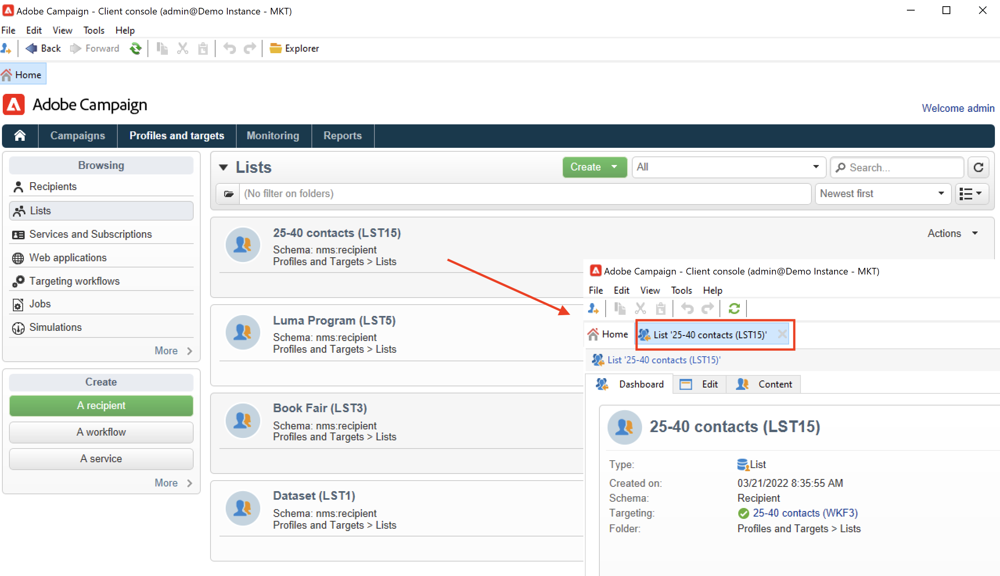

# Campagne-gebruikersinterface detecteren

## Interface voor toegangscampagne

De Campagne-werkruimte is beschikbaar via [Clientconsole](../architecture/general-architecture.md).

Leer om de Console van de Cliënt van de Campagne in te installeren en te vormen [deze sectie](../start/connect.md).

U kunt ook een webbrowser gebruiken om toegang te krijgen tot Campagne. In dit verband is slechts een subset van campagnemogelijkheden beschikbaar. [Meer informatie](#web-browser)

## Door de gebruikersinterface bladeren

Zodra u met Campagne wordt verbonden, hebt u toegang tot de homepage. Blader door de koppelingen naar toegangsmogelijkheden. Welke mogelijkheden beschikbaar zijn in de gebruikersinterface, is afhankelijk van uw opties en machtigingen.

Vanuit het centrale gedeelte van de startpagina gebruikt u koppelingen naar de Help-materialen voor campagnes, de community en de ondersteuningswebsite.

Gebruik de tabbladen in de bovenste sectie om te bladeren in de belangrijkste mogelijkheden van de campagne:

>[!NOTE]
>
>De lijst met kernmogelijkheden waartoe u toegang hebt, is afhankelijk van uw machtigingen en uw implementatie.

Voor elk vermogen, kunt u tot de reeks zeer belangrijke eigenschappen in toegang hebben **[!UICONTROL Browsing]** sectie. De **[!UICONTROL More]** Met de koppeling hebt u toegang tot alle andere componenten.

Als u bijvoorbeeld naar de **[!UICONTROL Profiles and targets]** kunt u toegang krijgen tot de lijsten met ontvangers, abonnementsservices, bestaande workflows voor activering en de sneltoetsen voor het maken van al deze componenten.

Wanneer u een element op het scherm selecteert, wordt het in een nieuw lusje geladen zodat u gemakkelijk inhoud kunt doorbladeren.

## Een element maken {#create-an-element}

Sneltoetsen gebruiken in het dialoogvenster **[!UICONTROL Create]** aan de linkerkant van het scherm om nieuwe elementen toe te voegen. U kunt ook de opdracht **[!UICONTROL Create]** boven de lijst om nieuwe elementen aan de huidige lijst toe te voegen.

Gebruik bijvoorbeeld op de leveringspagina de **[!UICONTROL Create]** om een nieuwe levering te maken.

## Webbrowser gebruiken {#web-browser}

Via een webbrowser hebt u ook toegang tot een subset met campagnemogelijkheden.

De interface van de Webtoegang is gelijkaardig aan de consoleinterface. Vanuit een browser kunt u dezelfde navigatie- en weergavefuncties gebruiken als in de console, maar u kunt slechts een beperkte set acties op campagnes uitvoeren. U kunt bijvoorbeeld campagnes weergeven en annuleren, maar u kunt geen campagnes wijzigen.

 [Meer informatie over Campagne voor webtoegang](../start/connect.md#web-access).

## Campagneverkenner openen {#ac-explorer-ui}

Blader in Campagneverkenner om toegang te krijgen tot alle Adobe Campaign-mogelijkheden en -instellingen.

In deze werkruimte hebt u toegang tot de Explorer-structuur om door alle functies en opties te bladeren.

De linkersectie toont de boom van de Ontdekkingsreiziger van de Campagne en laat u alle componenten en montages van uw instantie doorbladeren - die op uw toestemmingen wordt gebaseerd.

In de bovenste sectie ziet u de lijst met records in de huidige map. Deze lijsten zijn volledig aanpasbaar. [Meer informatie](customize-ui.md)

In de onderste sectie worden de details van de geselecteerde record weergegeven.

## Talen

De gebruikersinterface van Campagne v8 is beschikbaar in de volgende talen:

* Engels (VK)
* Engels (VS)
* Frans
* Duits
* Japans

De taal wordt geselecteerd tijdens het installatieproces.

>[!CAUTION]
>
>De taal kan na het maken van de instantie niet meer worden gewijzigd.

Taal is van invloed op datums en tijdnotaties.

De belangrijkste verschillen tussen het Engels van de VS en het Engels van het Verenigd Koninkrijk zijn:

<table> 
 <thead> 
  <tr> 
   <th> Indelingen  </th> 
   <th> Engels (VS)  </th> 
   <th> Engels (EN)  </th> 
  </tr> 
 </thead> 
 <tbody> 
  <tr> 
   <td> Datum  </td> 
   <td> Week begint op zondag  </td> 
   <td> Week begint op maandag  </td> 
  </tr> 
  <tr> 
   <td> Korte datum  </td> 
   <td> 
%2M/%2D/%4Y

<strong>ex: 25-09-2018</strong>
 </td> 
   <td> 
%2D/%2M/%4Y

<strong>ex: 09-25-2018</strong>
 </td> 
  </tr> 
  <tr> 
   <td> Korte datum met tijd  </td> 
   <td> 
%2M/%2D/%4Y %I:%2N:%2S %P

<strong>ex: 25-09-2018 10:47:25:00</strong>
 </td> 
   <td> 
%2D/%2M/%4Y %2H:%2N:%2S

<strong>ex: 09-25-2018 22:47:25</strong>
 </td> 
  </tr> 
 </tbody> 
</table>
