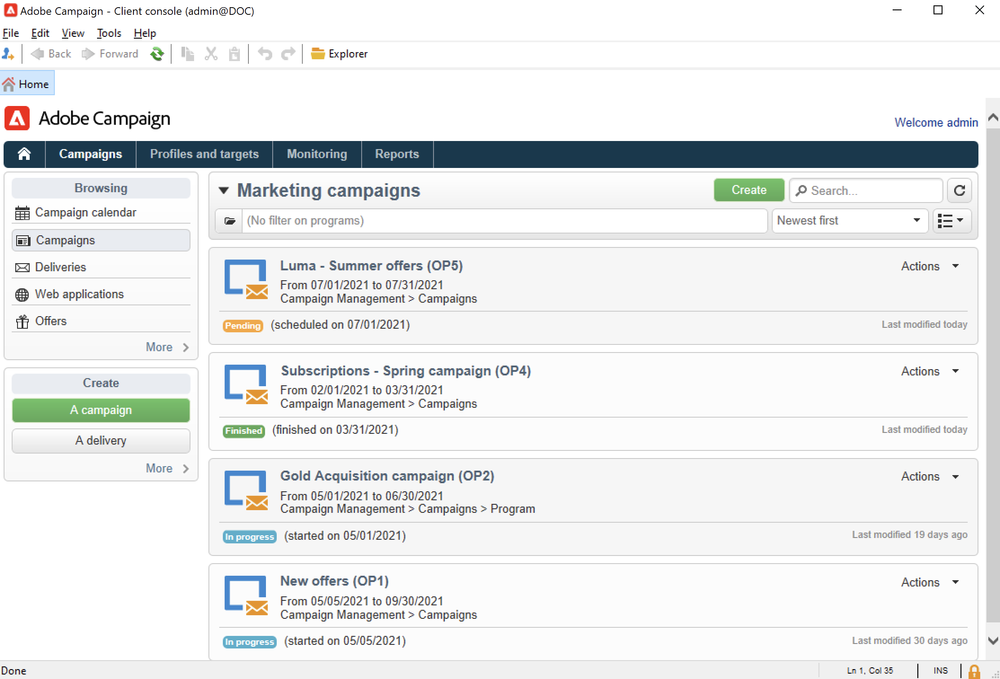

# Aan de slag met campagnes{#gs-ac-campaigns}

Adobe Campaign biedt een reeks oplossingen die u helpen campagnes op al uw online en offline kanalen aan te passen en te leveren. U kunt marketingcampagnes maken, configureren, uitvoeren en analyseren. Alle marketing campagnes kunnen van een verenigd controlecentrum worden beheerd. Ontdek in deze sectie hoe u door marketingcampagnes kunt bladeren en deze kunt maken.

De campagnes omvatten acties (leveringen) en processen (het invoeren of het halen van dossiers), evenals middelen (marketing documenten, leveringsoverzichten). Ze worden gebruikt in marketingcampagnes. Campagnes maken deel uit van een programma en programma&#39;s zijn opgenomen in een campagneplan.

## Kanaaloverschrijdende campagneorchestratie{#cross-channel-orchestration}

Met Adobe Campaign kunt u doelgerichte en gepersonaliseerde campagnes ontwerpen en organiseren op meerdere kanalen: e-mail, direct mail, sms, pushmelding. Één enkele interface voorziet u van alle functies die worden vereist om, al uw campagnes en mededelingen te plannen, te organiseren, te vormen, te personaliseren, uit te voeren en te meten.

### Basisbegrippen{#ac-core-concepts}

Voordat u marketingcampagnes gaat implementeren, moet u vertrouwd zijn met de volgende concepten:

* **Marketingcampagne**: een campagne centraliseert alle elementen die verband houden met een marketingcampagne: leveringen, doelgerichte regels, kosten, exportbestanden, verwante documenten, enz. Elke campagne is aan een programma verbonden.

* **Programma**: in een programma kunt u marketingacties definiëren voor een kalenderperiode: starten, kanaliseren, loyaliteit, enzovoort. Elk programma bevat campagnes die zijn gekoppeld aan een kalender, die een algemeen overzicht biedt.

* **Plan**: het marketingplan kan meerdere programma&#39;s bevatten. Het is gekoppeld aan een kalenderperiode, heeft een toegewezen budget en kan ook worden gekoppeld aan documenten en doelstellingen.

* **Campagne-workflow**: een campagnewerkstroom bevat activiteiten om de campagnogica op te bouwen. Met campagneworkflows kunt u doelgroepen definiëren en leveringen voor alle beschikbare kanalen maken.

* **Recurricampagnes**: terugkerende campagnes worden gecreeerd van een specifiek malplaatje dat het werkschemamalplaatje bepaalt dat en het uitvoeringsprogramma moet worden uitgevoerd.

* **Periodieke campagnes**: een periodieke campagne is een campagne die automatisch volgens het uitvoeringsprogramma van zijn malplaatje wordt gecreeerd.

## Werkruimte voor marketingcampagne{#ac-workspace}

Adobe Campaign laat u alle marketing campagnes van een verenigd controlecentrum tot stand brengen, vormen, uitvoeren en analyseren.

Ontdek hoe u marketingcampagnes kunt openen en implementeren in [deze sectie](https://experienceleague.adobe.com/docs/campaign/automation/campaign-orchestration/set-up-campaigns.html){target="_blank"}.

## Belangrijkste stappen om te beginnen{#gs-ac-start}

De belangrijkste stappen om een kanaalmarketingcampagne te creëren zijn:

1. **Marketingprogramma&#39;s en campagnes plannen en ontwerpen**

   Definieer hiërarchie en planning, stel het budget in, voeg bronnen toe en selecteer operatoren.

   Leer hoe u een marketingplan maakt en campagnes configureert in [deze pagina](https://experienceleague.adobe.com/docs/campaign/automation/campaign-orchestration/marketing-campaign-create.html){target="_blank"}.

   Alle marketingcampagnes zijn gebaseerd op een sjabloon waarin de belangrijkste instellingen en mogelijkheden worden opgeslagen. Een ingebouwde sjabloon wordt geleverd om een campagne te maken waarvoor geen specifieke configuratie is gedefinieerd. U kunt uw campagnemalplaatjes tot stand brengen en vormen en dan campagnes van deze malplaatjes tot stand brengen.

   Meer informatie over het werken met campagnemasjablonen vindt u in [deze pagina](https://experienceleague.adobe.com/docs/campaign/automation/campaign-orchestration/marketing-campaign-templates.html){target="_blank"}.

   Ontdek terugkomende campagnes en hoe te om hen te vormen in [deze pagina](https://experienceleague.adobe.com/docs/campaign/automation/campaign-orchestration/recurring-periodic-campaigns.html){target="_blank"}.

1. **Soorten publiek definiëren**

   U kunt het publiek in een werkschema bouwen of een bestaande groep, zoals een ontvankelijke lijst, abonnees van een nieuwsbrief, ontvangers van een vorige levering, of om het even welke het filtreren voorwaarde selecteren.

   

   Leer hoe u het publiek van uw berichten kunt definiëren in [deze pagina](https://experienceleague.adobe.com/docs/campaign/automation/campaign-orchestration/marketing-campaign-target.html){target="_blank"}.

1. **Leveringen maken**

   Selecteer kanalen, definieer de inhoud van het bericht en start de leveringen.

   

   Meer informatie over het maken en starten van marketingcampagneleveringen in [deze pagina](https://experienceleague.adobe.com/docs/campaign/automation/campaign-orchestration/marketing-campaign-deliveries.html){target="_blank"}.

   U kunt verschillende documenten koppelen aan een campagne: rapport, foto, webpagina, diagram, enzovoort.

   Meer informatie over gekoppelde documenten in [deze pagina](https://experienceleague.adobe.com/docs/campaign/automation/campaign-orchestration/marketing-campaign-assets.html){target="_blank"}.

1. **Goedkeuringsprocedure instellen**

   Met Adobe Campaign kunt u gezamenlijke goedkeuringsprocessen instellen voor de belangrijkste fasen van de marketingcampagne. Voor elke campagne kunt u het leveringsdoel, de inhoud, en de kosten goedkeuren. Adobe Campaign-operatoren die met de goedkeuring zijn belast, kunnen via e-mail op de hoogte worden gesteld en kunnen goedkeuring van de console of via een webverbinding accepteren of afwijzen.

   Leer hoe u goedkeuringen kunt instellen en beheren in [deze pagina](https://experienceleague.adobe.com/docs/campaign/automation/campaign-orchestration/marketing-campaign-approval.html#campaign-orchestration){target="_blank"}.

## Distributed Marketing Add-on{#distributed-marketing-add-on}

Adobe Campaign biedt een **Distributed Marketing** add-on voor de uitvoering van samenwerkingscampagnes tussen centrale entiteiten (hoofdkantoor, marketingafdelingen, enz.) en lokale entiteiten (winkels, regionale agentschappen, enz.). Deze samenwerking is gebaseerd op een gedeelde werkruimte, die bekend staat als de **[!UICONTROL List of campaign packages]**, waarbij door centrale entiteiten ontworpen campagnemalplaatjes worden aangeboden aan lokale entiteiten.

>[!NOTE]
>
>Deze mogelijkheid is beschikbaar vanaf Campagne v8.3. Als u uw versie wilt controleren, raadpleegt u [deze sectie](compatibility-matrix.md#how-to-check-your-campaign-version-and-buildversion)

Leer hoe te om Campagne te vormen en te gebruiken verdeelde de Marketingmogelijkheden in [deze pagina](https://experienceleague.adobe.com/docs/campaign/automation/distributed-marketing/about-distributed-marketing.html){target="_blank"}.

## Invoegtoepassing responsbeheer{#response-manager-add-on}

Adobe Campaign biedt een **Responsbeheer** toe:voegen die u het succes en de rentabiliteit van marketing campagnes laat meten of voorstellen over communicatiekanalen aanbiedt: e-mail, mobiel, direct post, enz.

>[!NOTE]
>
>Deze mogelijkheid is beschikbaar vanaf Campagne v8.3. Als u uw versie wilt controleren, raadpleegt u [deze sectie](compatibility-matrix.md#how-to-check-your-campaign-version-and-buildversion)

 Leer hoe u Campagne Response Manager configureert en gebruikt in [Campaign Classic v7-documentatie](https://experienceleague.adobe.com/docs/campaign-classic/using/response-manager/about-response-manager.html){target="_blank"}.
