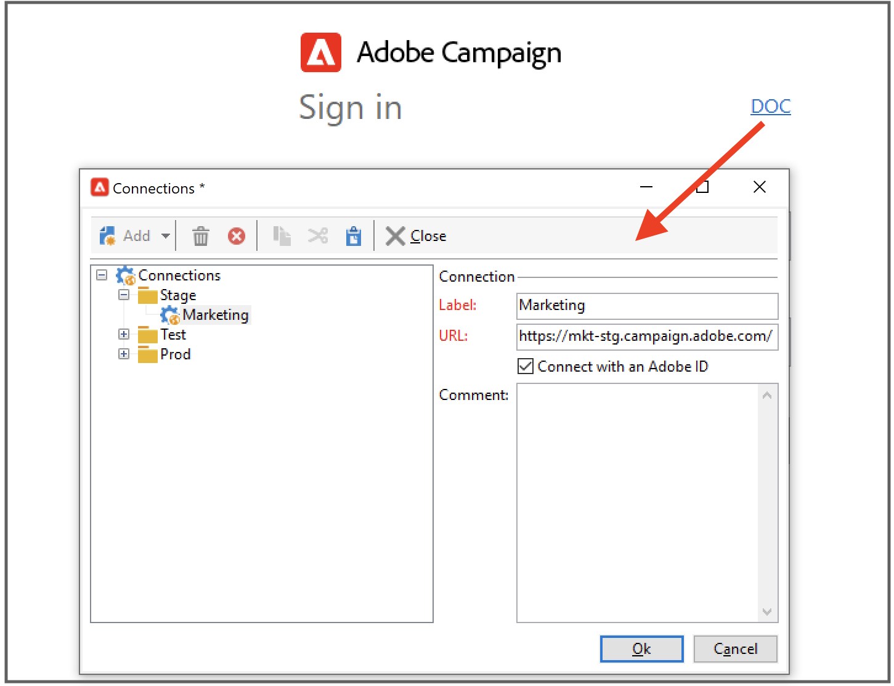
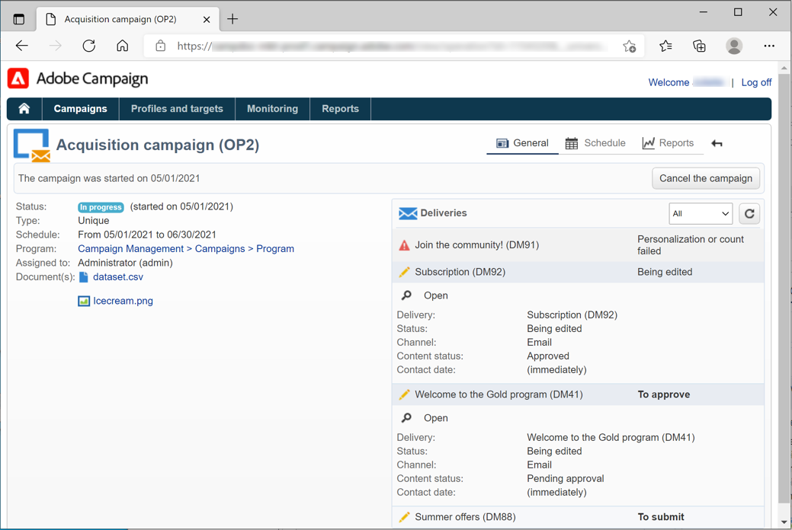

# Verbinding maken met Adobe Campaign v8{#gs-ac-connect}

Als u wilt gaan werken met Campagne, moet u de Client Console installeren en configureren.

De clientconsole is een native toepassing die communiceert met de Adobe Campaign-toepassingsserver via standaard internetprotocollen, zoals SOAP en HTTP. De console van de Cliënt van de campagne centraliseert alle mogelijkheden en montages, en vereist minimale bandbreedte aangezien het op een lokaal geheime voorgeheugen baseert. De Campagne Client Console is ontworpen voor eenvoudige implementatie en kan worden geïmplementeerd vanuit een internetbrowser, automatisch worden bijgewerkt. Hiervoor is geen specifieke netwerkconfiguratie nodig omdat alleen HTTP(S)-verkeer wordt gegenereerd.

Voordat u begint, moet u:

* Controleer de compatibiliteit van uw systeem en gereedschappen met Adobe Campaign in de [Compatibiliteitsmatrix](compatibility-matrix.md)
* URL van campagneserver ophalen
* Maak je Adobe ID of ontvang je gebruikersgegevens van je bedrijf
* Installeer de Microsoft Edge Webview2-runtime op uw systeem. [Meer informatie](#webview)

## De clientconsole installeren{#download-ac-console}

### Microsoft Edge Webview2-runtime {#webview}

Vanuit de Campaign Classic 8.4-build-versie is de installatie van de Microsoft Edge Webview 2-runtime vereist voor elke installatie van de Client Console.

De webweergave wordt standaard geïnstalleerd als onderdeel van het besturingssysteem Windows 11. Als dit nog niet het geval is op uw systeem, wordt u via het installatieprogramma van de Campagne Client Console gevraagd het programma te downloaden van [Microsoft Developer-website](http://www.adobe.com/go/acc-ms-webview2-runtime-download){target="_blank"}. De downloadkoppeling werkt niet in Internet Explorer 11, omdat Microsoft de ondersteuning heeft vervangen. Zorg ervoor dat u een andere browser gebruikt om de koppeling te openen.

### De console downloaden{#install-ac-console}

Wanneer u Campagne voor de eerste keer gebruikt, moet u de Client Console downloaden en installeren.

Er zijn twee opties beschikbaar om de clientconsole te downloaden:

1. Als beheerder van de Campagne, verbind met Adobe [Softwaredistributie](https://experience.adobe.com/#/downloads/content/software-distribution/en/campaign.html){target="_blank"}.

1. Als eindgebruiker, stelt uw beheerder van de Campagne de Console van de Cliënt voor u op, en stelt het beschikbaar door een specifieke URL.

Nadat het installatieprogramma van de clientconsole is gedownload, installeert u dit op uw lokale computer.

U kunt de taal van de clientconsole niet wijzigen nadat u deze hebt geïnstalleerd.

## Verbinding maken{#create-your-connection}

Nadat de clientconsole is geïnstalleerd, voert u de onderstaande stappen uit om de verbinding met de toepassingsserver tot stand te brengen:

1. Start de console en blader in de rechterhoek naar de koppeling om het scherm voor de verbindingsconfiguratie te openen.

1. Klikken **[!UICONTROL Add > Connection]** en voert u het label en de URL van de Adobe Campaign-toepassingsserver in.

1. Geef een verbinding met uw Adobe Campaign-toepassingsserver op via een URL. Gebruik of DNS of een alias van de machine, of uw IP adres.

   U kunt bijvoorbeeld de opdracht [`https://<machine>.<domain>.com`](https://myserver.adobe.com) type URL.

1. Schakel de optie  in **[!UICONTROL Connect with an Adobe ID]**.

1. Klikken **[!UICONTROL Ok]** om uw instellingen op te slaan.

U kunt zo veel verbindingen toevoegen als u nodig hebt om bijvoorbeeld verbinding te maken met uw test-, stage- en productieomgeving.

>[!NOTE]
>
>De **[!UICONTROL Add]** knop laat u maken **[!UICONTROL folders]** om al uw verbindingen te organiseren. U hoeft alleen elke verbinding naar een map te slepen.

## Aanmelden bij Adobe Campaign {#logon-to-ac}

Campagnegebruikers maken via hun Adobe ID verbinding met de Adobe Campaign-console via het Adobe Identity Management System (IMS). Ze kunnen dezelfde id gebruiken voor alle Adobe-oplossingen. De verbinding wordt bewaard wanneer het gebruiken van Adobe Campaign met andere oplossingen. Meer informatie over Adobe IMS in [deze pagina](https://helpx.adobe.com/enterprise/using/identity.html){target="_blank"}.

Volg onderstaande stappen om u aan te melden bij een instantie:

1. Start de console en blader in de rechterhoek naar de koppeling om het scherm voor de verbindingsconfiguratie te openen.

   

1. Selecteer de instantie Campagne waaraan u zich moet aanmelden.

1. Klik op **[!UICONTROL Ok]**.

U kunt zich vervolgens aanmelden bij Campagne met uw Adobe ID.

>[!NOTE]
>
>Aangezien Microsoft Edge Webview2 geen proxyreferenties opslaat, wordt u mogelijk door de Console gevraagd om tweemaal te verifiëren bij de eerste verbinding.

## Uw clientconsole upgraden{#upgrade-ac-console}

Wanneer uw systeem is bijgewerkt naar een nieuwere versie, moet u de clientconsole bijwerken naar dezelfde versie. Dit is een beste praktijk, en voor sommige versies is deze verbetering verplicht. In dat geval wordt dit vermeld in het [Opmerkingen bij de release](release-notes.md).

Als Beheerde gebruiker van Cloud Services, stelt Adobe de Console van de Cliënt voor u op. Wanneer u verbinding maakt met uw geüpgrade omgeving, wordt u gevraagd om de nieuwste versie van de clientconsole te downloaden in een pop-upvenster. U moet deze upgrade accepteren en de clientconsole naar wens bijwerken.

>[!CAUTION]
>
>Adobe raadt u aan deze optie te laten **[!UICONTROL No longer ask this question]** niet geselecteerd om ervoor te zorgen dat u gewaarschuwd wordt wanneer een nieuwe versie van de Console beschikbaar is. Als deze optie is geselecteerd, wordt de gebruiker niet geïnformeerd dat een consoleverbetering is vereist.

## Toegang verlenen aan gebruikers{#grant-access}

Met Adobe Campaign kunt u de rechten definiëren en beheren die aan de verschillende operatoren zijn toegewezen.

Als campagnebeheerder bent u verantwoordelijk voor het maken van de operatoren en het delen van hun referenties met de gebruikers.

Meer informatie over gebruikers en het definiëren van hun machtigingen vindt u in [deze sectie](gs-permissions.md).

## Webtoegang{#web-access}

Bepaalde delen van de toepassing zijn toegankelijk via een webbrowser via een HTML-gebruikersinterface: rapportage, goedkeuring van levering, controle van instanties, en meer.

De toegang van het Web verstrekt een interface die aan de console maar met een verminderde reeks functionaliteiten gelijkaardig is.

Bijvoorbeeld, voor een bepaalde exploitant, zal een campagne met de volgende opties in de console verschijnen:

Terwijl met de toegang van het Web, de opties hoofdzakelijk het bekijken zullen toelaten:

De toegang van het Web wordt ook gebruikt aan in het bevestigingsproces: operators kunnen klikken op de goedkeuringsaanvraag per e-mail en via hun webbrowser verbinding maken met Campagne om een leveringsinhoud of -budget te valideren of af te wijzen.

De URL is:  `https://<your adobe campaign server>:<port number>/view/home`.
