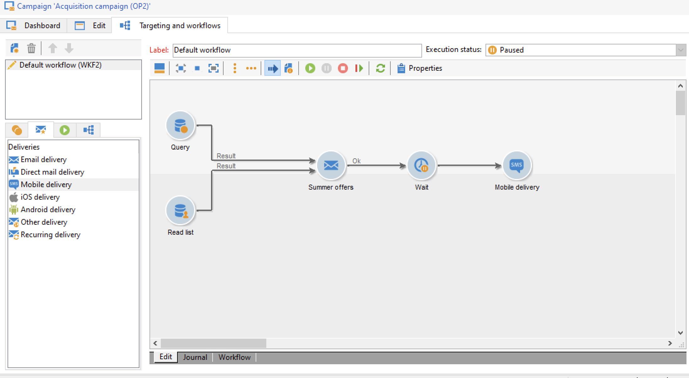

# Aan de slag met berichten{#gs-ac-audiences}

Met Adobe Campaign kunt u kanaalcampagnes verzenden, waaronder e-mails, SMS, pushmeldingen en directe mails, en de doeltreffendheid van deze campagnes meten aan de hand van verschillende speciale rapporten. Deze berichten worden ontworpen en verzonden door leveringen, en kunnen voor elke ontvanger worden gepersonaliseerd.

De kernfuncties omvatten het richten, het bepalen en het personaliseren van berichten, de uitvoering van mededelingen, en de bijbehorende operationele rapporten. Het belangrijkste functionele toegangspunt is de leveringsmedewerker. Dit toegangspunt leidt tot meerdere mogelijkheden die door Adobe Campaign worden gedekt.

Leer belangrijke stappen om levering in [Campaign Classic v7 documentatie](https://experienceleague.adobe.com/docs/campaign-classic/using/sending-messages/key-steps-when-creating-a-delivery/steps-about-delivery-creation-steps.html) tot stand te brengen.

Adobe Campaign v8 wordt geleverd met de volgende leveringskanalen:

* **E-mailkanaal**: Met e-mailleveringen kunt u persoonlijke e-mails sturen naar de doelgroep. Meer informatie vindt u op [deze pagina](../send/email.md).

* **Direct-mailkanaal**: met direct mail kunt u een extractiebestand genereren dat gegevens over de doelpopulatie bevat.  Meer informatie op [deze pagina](../send/direct-mail.md)

* **Mobiel kanaal**: Met leveringen op mobiele kanalen kunt u persoonlijke SMS naar de doelgroep sturen.  Meer informatie op [deze pagina](../send/sms.md)

* **Mobiel toepassingskanaal**: Met levering voor mobiele apps kunt u meldingen verzenden naar iOS- en Android-systemen.  Meer informatie op [deze pagina](../send/push.md)

<!--
* **LINE channel**: LINE deliveries let you send messages on LINE, an instant messaging application available on all smartphones. Learn more in [this page](../send/line.md)
-->

## Geef op hoe berichten moeten worden verzonden

Nadat u het bericht hebt gemaakt en de inhoud ervan hebt ontworpen en getest, kunt u kiezen hoe u het bericht wilt verzenden. De campagne biedt een reeks mogelijkheden aan:

* Handmatig berichten verzenden naar het hoofddoel

   

   [!DNL :arrow_upper_right:] Leer hoe u berichten verzendt in  [Campaign Classic v7-documentatie](https://experienceleague.adobe.com/docs/campaign-classic/using/sending-messages/sending-emails/sending-an-email/sending-messages.html){target=&quot;_blank&quot;}

* Verzend berichten verbonden aan een [marketing campagne](campaigns.md)

   

   [!DNL :arrow_upper_right:] Leer hoe u berichten verzendt in het kader van een campagne in  [Campaign Classic v7-documentatie](https://experienceleague.adobe.com/docs/campaign-classic/using/orchestrating-campaigns/orchestrate-campaigns/marketing-campaign-deliveries.html){target=&quot;_blank&quot;}

* Berichten verzenden via een [workflow](../config/workflows.md)

   

   [!DNL :arrow_upper_right:] Leer hoe u e-mailleveringen kunt automatiseren in  [Campaign Classic v7-documentatie](https://experienceleague.adobe.com/docs/campaign-classic/using/automating-with-workflows/action-activities/delivery.html){target=&quot;_blank&quot;}

* [Berichten ](../send/transactional.md) uit een gebeurtenis activeren
   [!DNL :arrow_upper_right:] [Hoofdlettergebruik: leren hoe u een transactie-e-mail met een bijlage](https://experienceleague.adobe.com/docs/campaign-classic/using/transactional-messaging/transactional-email-with-attachments.html?lang=en) verzendt {target=&quot;_blank&quot;}

* Uw berichten plannen

   

   [!DNL :arrow_upper_right:] [Hoofdlettergebruik: leer hoe u een verjaardagse-mail](https://experienceleague.adobe.com/docs/campaign-classic/using/automating-with-workflows/use-cases/deliveries/sending-a-birthday-email.html?) plant en verzendt {target=&quot;_blank&quot;}

## Aanpassing toevoegen

Berichten die door Adobe Campaign worden geleverd, kunnen op verschillende manieren worden gepersonaliseerd.

U kunt:

* Dynamische personalisatievelden invoegen.
   [!DNL :arrow_upper_right:] Leer hoe u verpersoonlijkingsvelden kunt gebruiken in  [Campaign Classic v7-documentatie](https://experienceleague.adobe.com/docs/campaign-classic/using/sending-messages/personalizing-deliveries/personalization-fields.html){target=&quot;_blank&quot;}
* Vooraf gedefinieerde personalisatieblokken invoegen.
   [!DNL :arrow_upper_right:] Leer wat een verpersoonlijkingsblok is en hoe u dit kunt gebruiken in  [Campaign Classic v7-documentatie](https://experienceleague.adobe.com/docs/campaign-classic/using/sending-messages/personalizing-deliveries/personalization-blocks.html){target=&quot;_blank&quot;}
* Voorwaardelijke content maken.
   [!DNL :arrow_upper_right:] Leer hoe u voorwaardelijke inhoud invoegt in  [Campaign Classic v7-documentatie](https://experienceleague.adobe.com/docs/campaign-classic/using/sending-messages/personalizing-deliveries/conditional-content.html){target=&quot;_blank&quot;}

## Transactieberichten verzenden

Transactioneel overseinen (het Centrum van het Bericht) is de module van de Campagne die voor het beheren van trekkerberichten wordt ontworpen.

[!DNL :bulb:] Meer informatie over de mogelijkheid van transactieberichten vindt u in  [deze sectie](../dev/architecture.md#transac-msg-archi)

[!DNL :bulb:] De stappen om transactieberichten te vormen en te verzenden zijn gedetailleerd in  [deze pagina](../send/transactional.md)

[!DNL :arrow_upper_right:] Ontdek deze mogelijkheid in een gebruiksgeval van begin tot eind in  [Campaign Classic v7 documentatie](https://experienceleague.adobe.com/docs/campaign-classic/using/transactional-messaging/transactional-email-with-attachments.html){target=&quot;_blank&quot;}

## Logbestanden voor aflevering en bijhouden

Het controleren van uw leveringen nadat deze zijn verzonden, is een belangrijke stap om ervoor te zorgen dat uw marketingcampagnes efficiënt zijn en uw klanten bereiken. U kunt controleren na het verzenden van een levering, evenals begrijpen hoe de leveringsmislukkingen en quarantines worden beheerd.

[!DNL :arrow_upper_right:] Leer hoe u uw leveringen kunt controleren in  [Campaign Classic v7-documentatie](https://experienceleague.adobe.com/docs/campaign-classic/using/sending-messages/monitoring-deliveries/about-delivery-monitoring.html#sending-messages){target=&quot;_blank&quot;}

**Verwante** onderwerpen in Campaign Classic v7 documentatie:

[!DNL :arrow_upper_right:]  [Best practices](https://experienceleague.adobe.com/docs/campaign-classic/using/sending-messages/key-steps-when-creating-a-delivery/delivery-bestpractices/delivery-best-practices.html) voor levering {target=&quot;_blank&quot;}

[!DNL :arrow_upper_right:]  [Een e-mail](https://experienceleague.adobe.com/docs/campaign-classic/using/sending-messages/sending-emails/sending-an-email/sending-messages.html) testen en verzenden {target=&quot;_blank&quot;}

[!DNL :arrow_upper_right:]  [Proofs](https://experienceleague.adobe.com/docs/campaign-classic/using/sending-messages/key-steps-when-creating-a-delivery/steps-validating-the-delivery.html) verzenden{target=&quot;_blank&quot;}
