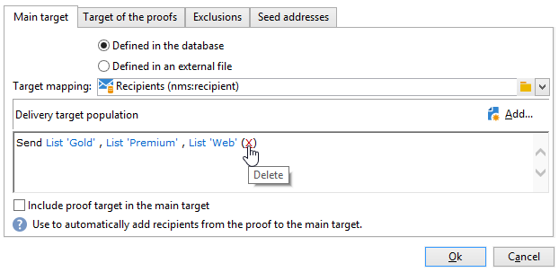

# Je eerste levering maken {#create-a-msg}

Leer op deze pagina hoe u één opname maakt van één levering. U kunt andere typen leveringen maken om uw gebruiksgevallen samen te stellen. Leer meer over de verschillende soorten leveringen en hoe te om hen in [ tot stand te brengen deze pagina ](gs-message.md).

De belangrijkste stappen bij het maken van een eenmalige levering zijn:

1. **creeer een nieuwe levering**. [Meer informatie](#create-the-delivery)

1. **bepaalt de leveringsinhoud**. [Meer informatie](#content-of-the-delivery)

1. **selecteer de doelbevolking**. [Meer informatie](#target-population)

Vervolgens kunt u berichten voorbereiden, testen, verzenden en controleren met Adobe Campaign.

>[!NOTE]
>
>De stappen die in deze sectie worden beschreven veronderstellen dat alle doelontvangers en hun profielen in het gegevensbestand, behalve in het geval van externe levering worden opgeslagen. Zie [ Selecterend externe ontvangers ](#selecting-external-recipients).

## De levering maken {#create-the-delivery}

Voer de volgende stappen uit om een levering te maken:

1. Blader naar de lijst met leveringen en klik op **[!UICONTROL Create]** .
1. Selecteer het leveringskanaal. Om dit te doen, verkies het aangewezen leveringsmalplaatje van de drop-down lijst.

   

   Er is een ingebouwde sjabloon beschikbaar voor elk kanaal dat u hebt geïnstalleerd: e-mail, telefoon, mobiele kanalen (push/SMS), direct mail, X (Twitter), enzovoort. Welke kanalen beschikbaar zijn in de lijst, is afhankelijk van uw licentieovereenkomst.

   U kunt nieuwe leveringsmalplaatjes tot stand brengen om specifieke parameters vooraf te vormen om uw behoeften aan te passen.  [Meer informatie](../send/create-templates.md).

1. Voer in het veld **[!UICONTROL Label]** een naam voor de levering in.

   (facultatief) Een leveringscode kan ook aan de levering worden toegewezen. De naam van de levering en de bijbehorende code zijn zichtbaar in de lijst van leveringen maar niet aan de ontvangers.

1. (optioneel) Voeg een beschrijving toe in het veld **[!UICONTROL Description]** .
1. (facultatief) selecteer de leveringsaard op het relevante gebied. Deze informatie is nuttig voor het volgen van de levering: u kunt filtreren gebaseerd op dit criterium in de leveringslijst of vragen bouwen gebruikend dit selectiecriterium.
1. Klik op **[!UICONTROL Continue]** om het venster met de berichtinhoud weer te geven.

## De inhoud van de levering definiëren {#content-of-the-delivery}

De leveringsinhoud is klaar om te worden gevormd. De definitie van de inhoud van de levering is specifiek voor elk kanaal. Raadpleeg de desbetreffende sectie voor meer informatie hierover:

* [De e-mailcontent opgeven](../send/email.md)
* [De SMS-inhoud definiëren](../send/sms/sms-content.md)
* [Content van direct mail definiëren](../send/direct-mail.md)
* [De inhoud van de pushmelding afzwakken](../send/push.md)

## Doelgroep definiëren {#target-population}

Voor elke levering, kunt u verscheidene soorten doelpubliek bepalen:

* **Belangrijkste publiek**: profielen die berichten ontvangen. [Meer informatie](#select-the-main-target)
* **doel van het Bewijs**: profielen die proefdrukberichten ontvangen. Een proef is een specifiek bericht dat u toestaat om een bericht te testen voordat het naar het hoofddoel wordt verzonden. [Meer informatie](#select-the-proof-target)

Daarnaast kunt u in het kader van een marketingcampagne het volgende toevoegen:

* **zaadadressen**: ontvangers die uit het leveringsdoel maar ontvangen de levering zijn. [Meer informatie](../audiences/test-profiles.md)
* **de groepen van de Controle**: de bevolking die niet de levering ontvangt, wordt gebruikt om gedrag en campagneeffect te volgen. [Meer informatie](../../automation/campaigns/marketing-campaign-target.md#add-a-control-group).

### Selecteer de belangrijkste ontvangers van de levering {#select-the-main-target}

In de meeste gevallen wordt het hoofddoel opgehaald uit de Adobe Campaign-database (standaardmodus). Nochtans, kunnen de ontvangers ook in een [ extern dossier ](#selecting-external-recipients) worden opgeslagen.

Volg onderstaande stappen om de ontvangers van een levering te selecteren:

1. Selecteer **[!UICONTROL To]** in de leveringseditor.
1. Als de ontvangers in het gegevensbestand worden opgeslagen, kies de eerste optie.

   {zoomable="yes"}

1. Selecteer de [ doelafbeelding ](../audiences/target-mappings.md) in de **[!UICONTROL Target mapping]** drop-down lijst.
1. Klik op de knop **[!UICONTROL Add]** om beperkingsfilters te definiëren.

   {width="60%" align="left" zoomable="yes"}

   Selecteer een type filter en klik op **[!UICONTROL Next]** om de voorwaarden te definiëren. U kunt de gefilterde ontvangers weergeven via het tabblad **[!UICONTROL Preview]** . Afhankelijk van het type doel kunt u met de knop **[!UICONTROL Refine target]** verschillende doelcriteria combineren.

   De volgende doeltypen zijn beschikbaar:

   * **[!UICONTROL Filtering conditions]** : gebruik deze optie om een query te definiëren en het resultaat weer te geven. Leer hoe te om een vraag in [ te ontwerpen deze sectie ](../../automation/workflow/query.md).
   * **[!UICONTROL A list of recipients]** : gebruik deze optie om een lijst met profielen als doel in te stellen. Leer meer over lijsten in [ deze sectie ](../audiences/create-audiences.md).
   * **[!UICONTROL A recipient]** : gebruik deze optie om een specifiek profiel in de database te selecteren.
   * **[!UICONTROL Recipients included in a folder]** : gebruik deze optie om alle profielen in een specifieke map als doel in te stellen.
   * **[!UICONTROL Recipients of a delivery]**: gebruik deze optie om het doel te maken van de ontvangers van een levering. U moet dan de levering in de lijst selecteren:

     

   * **[!UICONTROL Delivery recipients belonging to a folder]**: gebruik deze optie om het doel te maken van de ontvangers die in een specifieke map zijn geleverd.

     

     U kunt het gedrag van ontvangers filteren door een keuze te maken in de vervolgkeuzelijst:

     

     >[!NOTE]
     >
     >Met de optie **[!UICONTROL Include sub-folders]** kunt u ook de leveringen uitvoeren die zich bevinden in mappen in de boomstructuur onder het geselecteerde knooppunt.

   * **[!UICONTROL Subscribers of an information service]** : met deze optie kunt u een nieuwsbrief selecteren waarop de ontvangers moeten worden geabonneerd om de levering die wordt gemaakt als doel te hebben.

     

   * **[!UICONTROL User filters]**: met deze optie hebt u toegang tot de vooraf geconfigureerde filters om deze te gebruiken als filtercriteria voor profielen in de database. Vooraf gevormde filters worden voorgesteld in [ deze sectie ](../audiences/create-filters.md#default-filters).
   * Met de optie **[!UICONTROL Exclude recipients from this segment]** kunt u zich richten op ontvangers die niet aan de gedefinieerde doelcriteria voldoen. Als u deze optie wilt gebruiken, selecteert u het desbetreffende vak en past u vervolgens de focus toe, zoals eerder is gedefinieerd, om de resulterende profielen uit te sluiten.

1. Voer in het veld **[!UICONTROL Label]** een naam in voor dit doel. Standaard is het label het label van het eerste doelcriterium. Wanneer het combineren van het filtreren criteria, wordt het geadviseerd om een expliciete naam te gebruiken.
1. Klik op **[!UICONTROL Finish]** om de opties voor het opgeven van doelen te valideren.

   De gedefinieerde doelcriteria worden samengevat in het centrale gedeelte van het hoofdtabblad voor doelconfiguratie. Klik op een criterium om de inhoud ervan weer te geven (configuratie en voorvertoning). Als u een criterium wilt verwijderen, klikt u op het kruisje dat zich na het label bevindt.

   

### Externe ontvangers selecteren {#selecting-external-recipients}

U kunt berichten verzenden naar profielen die niet in de database maar in een extern bestand zijn opgeslagen. Als u bijvoorbeeld een levering wilt verzenden aan ontvangers die zijn geïmporteerd uit een tekstbestand, voert u de volgende stappen uit:

1. Klik op de koppeling **[!UICONTROL To]** om de ontvangers van de levering te selecteren.
1. Selecteer de optie **[!UICONTROL Defined in an external file]** .
1. Selecteer het bestand met de ontvangers.
1. Klik tijdens het importeren van de ontvangers op de koppeling **[!UICONTROL File format definition...]** om het externe bestand te selecteren en te configureren.

   Voor meer informatie over gegevensinvoer, verwijs naar [ Campaign Classic v7 documentatie ](https://experienceleague.adobe.com/en/docs/campaign-classic/using/getting-started/importing-and-exporting-data/generic-imports-exports/executing-import-jobs#step-2---source-file-selection) {target="_blank"}.

1. Klik op **[!UICONTROL Finish]** en configureer de levering als standaardlevering.

>[!CAUTION]
>
>Wanneer het bepalen van de inhoud van het bericht voor e-maillevering aan externe ontvangers, omvat niet de verbinding aan de spiegelpagina: het kan niet op deze leveringswijze worden geproduceerd.

### Uitsluitingsinstellingen {#define-exclusion-settings}

Wanneer het bepalen van het [ publiek van een levering ](#target-population), wordt het **[!UICONTROL Exclusions]** lusje gebruikt om het aantal berichten te beperken. Standaardparameters worden aanbevolen, maar u kunt de instellingen naar wens aanpassen. Deze opties mogen echter alleen door een deskundige gebruiker worden gewijzigd om elk misbruik en elke fout te voorkomen.

>[!CAUTION]
>
>Als deskundige gebruiker, voor specifieke gebruiksgevallen, kunt u deze montages veranderen, maar de Adobe adviseert om de standaardconfiguratie te houden.

U kunt adressen uitsluiten die een bepaald aantal opeenvolgende fouten hebben bereikt, of waarvan de kwaliteit onder een drempel is die in dit venster wordt gespecificeerd. U kunt ook kiezen of u niet-gekwalificeerde adressen waarvoor geen gegevens zijn geretourneerd, wilt autoriseren.

Als u de standaardconfiguratie wilt wijzigen, klikt u op de koppeling **[!UICONTROL Edit...]** .

+++ Zie beschikbare opties

* **[!UICONTROL Exclude duplicate addresses during delivery]**: deze optie is standaard actief en verwijdert dubbele e-mailadressen tijdens levering. De toegepaste strategie kan variëren afhankelijk van hoe Adobe Campaign wordt gebruikt en het type gegevens in het gegevensbestand. De waarde van de optie kan voor elke leveringsmalplaatje worden gevormd.
* **[!UICONTROL Exclude recipients who no longer want to be contacted]** , d.w.z. ontvangers wier e-mailadressen in de lijst van gewezen personen staan (&#39;Weigeren&#39;). Deze optie moet geselecteerd blijven om de beroepsethiek van e-marketing in acht te nemen.
* **[!UICONTROL Exclude quarantined recipients]** : met deze optie kunt u profielen met een adres dat in quarantaine is geplaatst, uitsluiten van het doel. We raden u ten zeerste aan deze optie geselecteerd te houden. Leer meer over quarantainebeheer in [ deze sectie ](../send/quarantines.md).
* **[!UICONTROL Limit delivery]** aan een bepaald aantal berichten. Met deze optie kunt u het maximum aantal berichten invoeren dat moet worden verzonden. Als het doelpubliek het aantal vermelde berichten overschrijdt, wordt een willekeurige selectie toegepast op het doel. Houd deze waarde in op &#39;0&#39; om alle berichten te verzenden.
* **[!UICONTROL Keep duplicate records (same identifier)]**: met deze optie kunnen meerdere leveringen worden verzonden naar ontvangers die aan verschillende doelcriteria voldoen.
+++

### Ontvangers van proefdrukberichten selecteren {#select-the-proof-target}

Voor e-mailleveringen kunt u proefdrukken verzenden om uw berichtinhoud te valideren. Door proefdrukken te verzenden, kunt u de koppeling om te weigeren controleren, de pagina spiegelen en andere koppelingen controleren, het bericht valideren, controleren of afbeeldingen worden weergegeven, mogelijke fouten opsporen, enz. Mogelijk wilt u ook uw ontwerp en rendering op verschillende apparaten controleren.

Een proef is een specifiek bericht dat u toestaat om een bericht te testen alvorens het naar het belangrijkste publiek te verzenden. Ontvangers van de proefdruk zijn verantwoordelijk voor het goedkeuren van het bericht: rendering, content, personalisatie-instellingen, configuratie.

Voor meer bij proefontvangers en het verzenden, verwijs naar [ deze sectie ](../send/preview-and-proof.md#send-proofs).

#### Video over zelfstudie {#seeds-and-proofs-video}

In deze video leert u hoe u zaden en proefdrukken aan een bestaande e-mail kunt toevoegen en hoe u deze kunt verzenden.

>[!VIDEO](https://video.tv.adobe.com/v/333404?quality=12)

De extra Campaign Classic hoe te video&#39;s zijn beschikbaar [ hier ](https://experienceleague.adobe.com/docs/campaign-classic-learn/tutorials/overview.html?lang=nl).

## De levering voorbereiden en valideren {#validate-the-delivery}

Wanneer een levering is gecreeerd en gevormd, moet u het bevestigen alvorens het naar het belangrijkste doel te verzenden.

Dit doet u als volgt:

1. **analyseert de levering**: deze stap laat u de berichten voorbereiden om te leveren. [Meer informatie](../send/delivery-analysis.md).

1. **verzendt proef**: deze stap laat u inhoud, URLs, verpersoonlijking, enz. controleren. [Meer informatie](../send/preview-and-proof.md).

>[!IMPORTANT]
>
>De twee stappen hierboven **moeten** na elke wijziging op de berichtinhoud worden uitgevoerd.

## De levering configureren en verzenden {#configuring-and-sending-the-delivery}

Heb toegang tot de leveringsparameters om meer montages te vormen en te bepalen hoe te om uw berichten te verzenden. U kunt leveringsprioriteit bepalen, opstelling verzendende golven, de retry montages bevestigen, en uw levering testen verzendend. Zodra deze configuratie wordt gedaan, kunt u het verzenden bevestigen. De berichten worden dan verzonden onmiddellijk, of gebaseerd op het leveringsprogramma.

Leer hoe te om uw leveringsmontages in [ te vormen deze pagina ](../send/configure-and-send.md).
