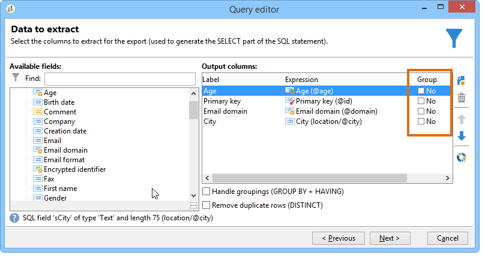

# Query Campaign-database

Vragen worden gemaakt met velden uit de geselecteerde tabel of met een formule.

De stappen voor het bouwen van een vraag in Adobe Campaign zijn als volgt:

1. [ selecteer de het werklijst ](#step-1---choose-a-table).
1. [ selecteer de gegevens om ](#step-2---choose-data-to-extract) te halen.
1. [ bepaalt de gegevens sorterende wijze ](#step-3---sort-data).
1. [ bepaalt gegevens het filtreren opties ](#step-4---filter-data).
1. [ vorm gegevens het formatteren ](#step-5---format-data).
1. [ Voorproef de resultaten van de vraag ](#step-6---preview-data).

Al deze stappen zijn beschikbaar in de [ generische vraagredacteur ](query-editor.md). Wanneer een query in een andere context wordt gemaakt, ontbreken mogelijk enkele stappen. Om meer over vragen te leren, zie ook de [ documentatie van de de activiteitenvraag van de werkschemavraag ](../../automation/workflow/query.md).

## Stap 1 - Kies een tabel {#step-1---choose-a-table}

Om het gegevensbestand van de Campagne te vragen, open de **[Algemene vraagredacteur](query-editor.md)**, en selecteer de lijst die de gegevens bevat u in het **[!UICONTROL Document type]** venster wilt vragen.

Indien nodig, filtert u de gegevens met het filterveld of de knop **[!UICONTROL Filters]** .

## Stap 2 - Kies de gegevens die u wilt extraheren {#step-2---choose-data-to-extract}

Kies in het scherm **[!UICONTROL Data to extract]** de velden die u in de uitvoer wilt opnemen. Deze gebieden zullen de kolommen bepalen die in de resultaten worden getoond.

U kunt bijvoorbeeld **[!UICONTROL Age]** , **[!UICONTROL Primary key]** , **[!UICONTROL Email domain]** en **[!UICONTROL City]** selecteren. De uitvoer wordt gestructureerd volgens deze selectie. Als u de volgorde van de kolommen wilt aanpassen, gebruikt u de blauwe pijlen aan de rechterkant van het venster.

U kunt een expressie wijzigen door een formule toe te voegen of door een proces toe te passen op een statistische functie. Als u een expressie wilt bewerken, klikt u op het kolomveld **[!UICONTROL Expression]** en selecteert u **[!UICONTROL Edit expression]** .

U kunt de gegevens groeperen die in de outputkolommen worden getoond. Selecteer hiervoor **[!UICONTROL Yes]** in de kolom **[!UICONTROL Group]** van het **[!UICONTROL Data to extract]** -venster. De resultaten worden vervolgens samengevoegd op basis van de geselecteerde groeperingsas. Voor een voorbeeld van een vraag die groeperen gebruikt, zie [ deze sectie ](../../automation/workflow/query-delivery-info.md).

* Met de optie **[!UICONTROL Handle groupings (GROUP BY + HAVING)]** kunt u resultaten groeperen en voorwaarden toepassen op deze groepen. Dit is van toepassing op alle velden in de uitvoerkolommen. U kunt deze bijvoorbeeld gebruiken om waarden uit een uitvoerkolom te groeperen en vervolgens de resultaten te filteren om alleen specifieke informatie op te halen, zoals ontvangers tussen 35 en 50 jaar oud.

  Raadpleeg [deze sectie](../../automation/workflow/query-grouping-management.md) voor meer informatie.

Met de optie **[!UICONTROL Remove duplicate rows (DISTINCT)]** verwijdert u identieke rijen uit de uitvoer (dedupliceren). Bijvoorbeeld, als u **Familienaam** selecteert, **Voornaam**, en **E-mail** als outputkolommen, zullen om het even welke verslagen met de zelfde waarden op alle drie gebieden als duplicaten worden beschouwd. Er wordt slechts één exemplaar in de resultaten bewaard, zodat elk contact maar één keer wordt weergegeven.

## Stap 3 - Gegevens sorteren {#step-3---sort-data}

In het **[!UICONTROL Sorting]** -venster kunt u kolominhoud sorteren. Gebruik de pijlen om de kolomvolgorde te wijzigen:

* Met de kolom **[!UICONTROL Sorting]** kunt u eenvoudig sorteren en de kolominhoud in oplopende volgorde rangschikken van A naar Z.
* In **[!UICONTROL Descending sort]** wordt de inhoud gerangschikt van Z naar A en in aflopende volgorde. Dit is bijvoorbeeld handig voor het weergeven van recordverkopen: de hoogste cijfers worden boven aan de lijst weergegeven.

In dit voorbeeld worden de gegevens in oplopende volgorde gesorteerd op basis van de leeftijd van de ontvanger.

## Stap 4 - Gegevens filteren {#step-4---filter-data}

De vraagredacteur staat u toe om gegevens te filtreren om uw resultaten te beperken. De beschikbare filters zijn afhankelijk van de tabel die u opvraagt.

Nadat u **[!UICONTROL Filtering conditions]** hebt geselecteerd, wordt de sectie **[!UICONTROL Target elements]** geopend. Hier, kunt u de regels bepalen voor het filtreren van de te verzamelen gegevens.

* Als u een nieuw filter wilt maken, kiest u de velden, operatoren en waarden die nodig zijn om de voorwaarde samen te stellen. U kunt veelvoudige voorwaarden ook combineren, zoals verklaard [ op deze pagina ](filter-conditions.md).

* Als u een bestaand filter opnieuw wilt gebruiken, klikt u op de knop **[!UICONTROL Add]** , selecteert u **[!UICONTROL Predefined filter]** en kiest u het gewenste filter.

  

Filters die in **[!UICONTROL Generic query editor]** worden gemaakt, kunnen opnieuw worden gebruikt in andere querytoepassingen en het omgekeerde is ook waar. Klik op het pictogram **[!UICONTROL Save]** om een filter voor later gebruik op te slaan.

>[!NOTE]
>
>Voor meer bij het creëren van en het gebruiken van filters, verwijs naar [ het Filtreren opties ](filter-conditions.md).

Zoals aangetoond in het volgende voorbeeld, om alle Engels-sprekende ontvangers terug te krijgen, selecteer: &quot;ontvankelijke taal **gelijk aan** EN&quot;.

>[!NOTE]
>
>U kunt tot een optie direct toegang hebben door de volgende formule op het **gebied van de Waarde** te typen: **$ (opties :OPTION_NAME)**.

Klik op de tab **[!UICONTROL Preview]** om het resultaat van de filtervoorwaarde weer te geven. In dit geval worden alle Engelstalige ontvangers weergegeven met hun naam, voornaam en e-mailadres.

Gebruikers die bekend zijn met SQL kunnen op **[!UICONTROL Generate SQL query]** klikken om de query in SQL weer te geven.

## Stap 5 - Gegevens opmaken {#step-5---format-data}

Nadat u de beperkingsfilters hebt geconfigureerd, wordt het venster **[!UICONTROL Data formatting]** geopend. In dit venster kunt u uitvoerkolommen opnieuw rangschikken, gegevens transformeren en het hoofdlettergebruik van kolomlabels aanpassen. U kunt ook formules toepassen op het uiteindelijke resultaat door een berekend veld te maken.

>[!NOTE]
>
>Voor meer informatie over de types van berekende gebieden, verwijs naar [ creeer berekende gebieden ](filter-conditions.md#creating-calculated-fields).

Niet-geselecteerde kolommen worden verborgen in het venster met gegevensvoorvertoning.

Met de kolom **[!UICONTROL Transformation]** kunt u een kolomlabel wijzigen in hoofdletters of kleine letters. Selecteer de kolom en klik in de kolom **[!UICONTROL Transformation]** . U kunt kiezen:

* **[!UICONTROL Switch to lower case]**,
* **[!UICONTROL Switch to upper case]**,
* **[!UICONTROL First letter in upper case]**.

## Stap 6 - Voorbeeldgegevens {#step-6---preview-data}

Het venster **[!UICONTROL Data preview]** markeert het laatste werkgebied van het queryproces. Klik op **[!UICONTROL Start the preview of the data]** om de resultaten te bekijken. Deze kunnen in kolommen of XML-indeling worden weergegeven. Open het tabblad **[!UICONTROL Generated SQL queries]** om de onderliggende SQL-query te bekijken. Deze stap laat u verifiëren dat uw vraag zich zoals verwacht gedraagt alvorens het verder te gebruiken.

In dit voorbeeld worden gegevens in oplopende volgorde gesorteerd op basis van de leeftijd van de ontvanger.

>[!NOTE]
>
>Net als in alle lijsten die beschikbaar zijn in de console, worden standaard alleen de eerste 200 regels weergegeven in het **[!UICONTROL Data preview]** -venster. Als u dit wilt wijzigen, typt u een getal in het vak **[!UICONTROL Lines to display]** en klikt u op **[!UICONTROL Start the preview of the data]** . [Meer informatie](../config/ui-settings.md#manage-and-customize-lists)

**Verwante onderwerpen**

* [Workflow Query Activity](../../automation/workflow/query.md)
* [Een query uitvoeren op de tabel met ontvangers](../../automation/workflow/querying-recipient-table.md)
* [Filteromstandigheden](filter-conditions.md)