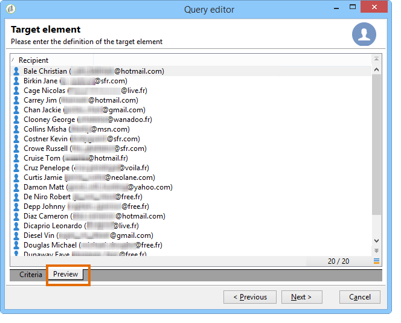

# Query Campaign-database

Vragen worden gemaakt met velden uit de geselecteerde tabel of met een formule.

De stappen voor het bouwen van een vraag in Adobe Campaign zijn als volgt:

1. Selecteer de werktabel. Verwijs naar [&#x200B; Stap 1 - kies een lijst &#x200B;](#step-1---choose-a-table).
1. Selecteer de gegevens die u wilt extraheren. Verwijs naar [&#x200B; Stap 2 - kies gegevens om &#x200B;](#step-2---choose-data-to-extract) te halen.
1. Definieer de gegevenssorteervolgorde. Verwijs naar [&#x200B; Stap 3 - de gegevens van de Soort &#x200B;](#step-3---sort-data).
1. Filter de gegevens. Verwijs naar [&#x200B; Stap 4 - de gegevens van de Filter &#x200B;](#step-4---filter-data).
1. Maak de gegevens op. Verwijs naar [&#x200B; Stap 5 - de gegevens van het Formaat &#x200B;](#step-5---format-data).
1. Geef het resultaat weer. Verwijs naar [&#x200B; Stap 6 - de gegevens van de Voorproef &#x200B;](#step-6---preview-data).

>[!NOTE]
>
>* Al deze stappen zijn beschikbaar in de [&#x200B; generische vraagredacteur &#x200B;](query-editor.md). Wanneer een query in een andere context wordt gemaakt, kunnen sommige stappen worden weggelaten.
>
>* Meer over Vragen leren en hoe te om hen tot stand te brengen, verwijs naar de [&#x200B; het werkschemadocumentatie van de Campagne &#x200B;](../../automation/workflow/query.md).

Om het gegevensbestand van de Campagne te vragen, open de **[Algemene vraagredacteur](query-editor.md)**, en volg deze stappen:

## Stap 1 - Kies een tabel {#step-1---choose-a-table}

Selecteer in het **[!UICONTROL Document type]** -venster de tabel met de gegevens waarop u een query wilt uitvoeren. Indien nodig, filtert u de gegevens met het filterveld of de knop **[!UICONTROL Filters]** .

## Stap 2 - Kies de gegevens die u wilt extraheren {#step-2---choose-data-to-extract}

Selecteer in het **[!UICONTROL Data to extract]** -venster de gegevens die u wilt weergeven: deze velden vormen de uitvoerkolommen.

Selecteer bijvoorbeeld **[!UICONTROL Age]** , **[!UICONTROL Primary key]** , **[!UICONTROL Email domain]** en **[!UICONTROL City]** . De resultaten worden op basis van deze selectie geordend. Gebruik de blauwe pijlen rechts van het venster om de kolomvolgorde te wijzigen.

U kunt een expressie bewerken door er een formule in op te nemen of door een proces uit te voeren voor een statistische functie. Klik hiertoe op het kolomveld **[!UICONTROL Expression]** en selecteer **[!UICONTROL Edit expression]** .

U kunt uitvoerkolomgegevens groeperen: hiervoor schakelt u **[!UICONTROL Yes]** in de **[!UICONTROL Group]** -kolom van het **[!UICONTROL Data to extract]** -venster in. Deze functie genereert een resultaat rond de geselecteerde groeperingsas. Een voorbeeld van een vraag met groepering is beschikbaar in [&#x200B; deze sectie &#x200B;](../../automation/workflow/query-delivery-info.md).

* Met de functie **[!UICONTROL Handle groupings (GROUP BY + HAVING)]** kunt u groeperen op en selecteren wat is gegroepeerd (&quot;hebben&quot;). Deze functie is van toepassing op alle velden in de uitvoerkolom. Met deze optie kunt u bijvoorbeeld alle keuzen van een uitvoerkolom groeperen en een bepaald type informatie herstellen, zoals ontvangers tussen 35 en 50.

  Raadpleeg [deze sectie](../../automation/workflow/query-grouping-management.md) voor meer informatie.

* Met de functie **[!UICONTROL Remove duplicate rows (DISTINCT)]** kunt u identieke resultaten dedupliceren die in de uitvoerkolom zijn verkregen. Als u bijvoorbeeld een telling uitvoert door de velden Achternaam, Voornaam en E-mail te selecteren in de uitvoerkolom, worden de velden met identieke gegevens verwijderd, omdat dit betekent dat dezelfde contactpersoon meerdere malen in de database is ingevoerd: er wordt slechts één resultaat in aanmerking genomen.

## Stap 3 - Gegevens sorteren {#step-3---sort-data}

In het **[!UICONTROL Sorting]** -venster kunt u kolominhoud sorteren. Gebruik de pijlen om de kolomvolgorde te wijzigen:

* Met de kolom **[!UICONTROL Sorting]** kunt u eenvoudig sorteren en de kolominhoud in oplopende volgorde rangschikken van A naar Z.
* In **[!UICONTROL Descending sort]** wordt de inhoud gerangschikt van Z naar A en in aflopende volgorde. Dit is bijvoorbeeld handig voor het weergeven van recordverkopen: de hoogste cijfers worden boven aan de lijst weergegeven.

In dit voorbeeld worden de gegevens in oplopende volgorde gesorteerd op basis van de leeftijd van de ontvanger.

## Stap 4 - Gegevens filteren {#step-4---filter-data}

Met de query-editor kunt u gegevens filteren om uw zoekopdracht te verfijnen.

De aangeboden filters zijn afhankelijk van de tabel waarop de query betrekking heeft.

Als u de sectie **[!UICONTROL Filtering conditions]** hebt geselecteerd, krijgt u toegang tot de sectie **[!UICONTROL Target elements]** . Hiermee kunt u definiëren hoe de te verzamelen gegevens worden gefilterd.

* Als u een nieuw filter wilt maken, selecteert u de velden, operatoren en waarden die nodig zijn voor het maken van de formule die moet worden gecontroleerd voordat de gegevens worden geselecteerd. U kunt verscheidene voorwaarden ook combineren zoals gedetailleerd [&#x200B; op deze pagina &#x200B;](filter-conditions.md).
* Als u eerder opgeslagen filters wilt gebruiken, opent u de vervolgkeuzelijst door op de knop **[!UICONTROL Add]** te klikken, op **[!UICONTROL Predefined filter]** te klikken en de gewenste filter te selecteren.

  

* De filters die in **[!UICONTROL Generic query editor]** worden gecreeerd zijn beschikbaar in andere vraagtoepassingen en vice versa. Klik op het pictogram **[!UICONTROL Save]** om een filter op te slaan.

  >[!NOTE]
  >
  >Voor meer bij het creëren van en het gebruiken van filters, verwijs naar [&#x200B; het Filtreren opties &#x200B;](filter-conditions.md).

Zoals aangetoond in het volgende voorbeeld, om alle Engels-sprekende ontvangers terug te krijgen, selecteer: &quot;ontvankelijke taal **gelijk aan** EN&quot;.

>[!NOTE]
>
>U kunt tot een optie direct toegang hebben door de volgende formule op het **gebied van de Waarde** te typen: **$ (opties :OPTION_NAME)**.

Klik op de tab **[!UICONTROL Preview]** om het resultaat van de filtervoorwaarde weer te geven. In dit geval worden alle Engelstalige ontvangers weergegeven met hun naam, voornaam en e-mailadres.

Gebruikers die bekend zijn met SQL kunnen op **[!UICONTROL Generate SQL query]** klikken om de query in SQL weer te geven.

## Stap 5 - Gegevens opmaken {#step-5---format-data}

Als u de beperkingsfilters hebt geconfigureerd, opent u het **[!UICONTROL Data formatting]** -venster. In dit venster kunt u de uitvoerkolommen opnieuw rangschikken, gegevens transformeren en het hoofdlettergebruik van de kolomlabels wijzigen. Hiermee kunt u ook een formule op het uiteindelijke resultaat toepassen met een berekend veld.

>[!NOTE]
>
>Voor meer informatie over de types van berekende gebieden, verwijs naar [&#x200B; creeer berekende gebieden &#x200B;](filter-conditions.md#creating-calculated-fields).

Niet-geselecteerde kolommen worden niet weergegeven in het venster met gegevensvoorvertoning.

Met de kolom **[!UICONTROL Transformation]** kunt u een kolomlabel wijzigen in hoofdletters of kleine letters. Selecteer de kolom en klik in de kolom **[!UICONTROL Transformation]** . U kunt kiezen:

* **[!UICONTROL Switch to lower case]**,
* **[!UICONTROL Switch to upper case]**,
* **[!UICONTROL First letter in upper case]**.

## Stap 6 - Voorbeeldgegevens {#step-6---preview-data}

Het **[!UICONTROL Data preview]** -venster is het laatste werkgebied. Klik op **[!UICONTROL Start the preview of the data]** om het queryresultaat op te halen. Deze optie is beschikbaar in kolommen of in XML-indeling. Klik op het tabblad **[!UICONTROL Generated SQL queries]** om de query in SQL-indeling weer te geven.

In dit voorbeeld worden gegevens in oplopende volgorde gesorteerd op basis van de leeftijd van de ontvanger.

>[!NOTE]
>
>Standaard worden alleen de eerste 200 regels weergegeven in het **[!UICONTROL Data preview]** -venster. Als u dit wilt wijzigen, typt u een getal in het vak **[!UICONTROL Lines to display]** en klikt u op **[!UICONTROL Start the preview of the data]** .

**Verwante onderwerpen**

* [Workflow Query Activity](../../automation/workflow/query.md)
* [Een query uitvoeren op de tabel met ontvangers](../../automation/workflow/querying-recipient-table.md)
* [Filteromstandigheden](filter-conditions.md)