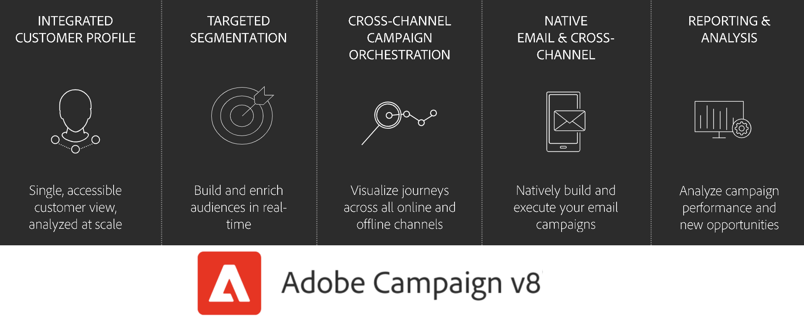

# Aan de slag met Adobe Campaign{#gs-ac-v8}

Adobe Campaign biedt een platform voor het ontwerpen van de ervaringen van klanten over meerdere kanalen en een omgeving voor visuele campagneorchestratie, real-time interactiebeheer en uitvoering via meerdere kanalen.

Campagne gebruiken om:

* **Drive** personalisatie en betrokkenheid via één toegankelijke weergave van de klant
* **Integreren** e-mail, mobiel, online en offline kanalen aan de reis van de klant
* **Automatisch** de levering van zinvolle en tijdige berichten en aanbiedingen

## Geïntegreerd klantprofiel {#integrated-customer-profile}

Profielen worden gecentraliseerd in een krachtige cloud-database. Er zijn vele mogelijke mechanismen om profielen te verwerven en dit gegevensbestand op te bouwen: online inzameling via Webvormen, handmatige, of automatische invoer van tekstdossiers, replicatie met bedrijfgegevensbestanden of andere informatiesystemen. Met Adobe Campaign kunt u de marketinggeschiedenis, aankoopdata, voorkeuren, CRM-data en alle relevante PII-data in een geconsolideerde weergave opnemen om te analyseren en actie te ondernemen.

In Adobe Campaign zijn ontvangers de standaardprofielen voor het verzenden van leveringen (e-mails, sms’en, enzovoort). Dankzij de ontvangerdata die in de database worden opgeslagen, kunt u het doel filteren dat een bepaalde levering zal ontvangen en personalisatiedata in uw leveringscontent toevoegen. De database bevat andere typen profielen. Ze zijn ontworpen voor verschillende applicaties. Seed-profielen worden bijvoorbeeld gemaakt om de leveringen te testen voordat ze naar het uiteindelijke doel worden verzonden.

 De grondbeginselen van profielbeheer worden uitgelegd in [deze sectie](audiences.md).

 Leer hoe u profielen aan Campagne kunt toevoegen in [deze sectie](import.md).

## Doelgerichte segmentatie {#targeted-segmentation}

Adobe Campaign beschikt over krachtige, gebruiksvriendelijke segmentatie- en targetingfuncties waarmee u heel doelgerichte, gedifferentieerde aanbiedingen kunt maken. Met de functionaliteit voor beschrijvende analyse kunt u informatie upstream en downstream van uw marketingcampagnes analyseren, en met de functionaliteit voor filterbeheer en de grafische query-editor kunt u uw ledenpopulatie filteren en doelgroepen testen en maken op basis van een onbeperkt aantal criteria.

De geavanceerde functionaliteit voor data management breidt de mogelijkheden voor dataverwerking uit. Het vereenvoudigt en optimaliseert het targetingproces door data op te nemen die niet in de datamart worden gemodelleerd.

 Meer informatie over segmentering en publiekscreatie in [deze sectie](audiences.md).

## Kanaaloverschrijdende orkestrering van campagnes {#cross-channel-campaign-orchestration}

Met Adobe Campaign kunt u doelgerichte en gepersonaliseerde campagnes ontwerpen en organiseren op meerdere kanalen: e-mail, direct mail, sms, pushmelding. Eén enkele interface voorziet u van alle functies die vereist zijn om al uw campagnes en communicatie te plannen, te organiseren, te configureren, te personaliseren, te automatiseren, uit te voeren en te meten.

 Leer hoe u in [deze sectie](campaigns.md).

## Workflows

Adobe Campaign biedt een uitgebreide grafische omgeving waarmee u complexe processen kunt ontwerpen, zoals segmentatie, uitvoering van campagnes, bestandsverwerking, enzovoort. U kunt bijvoorbeeld een workflow gebruiken om een bestand van een server te downloaden, het te decomprimeren en vervolgens de records in de Adobe Campaign-database te importeren.

Een werkstroom kan gebruikers ook betrekken door hen taken toe te wijzen of hen te laten uitgevoerde taken goedkeuren. Dit betekent u een taak aan één of verscheidene gebruikers kunt toewijzen om aan inhoud te werken of doelstellingen te specificeren, en proefdrukken goed te keuren alvorens het bericht te verzenden.

Workflows kunnen in verschillende contexten worden gebruikt, zoals:

* Het richten om publiek te beheren of berichten te verzenden.
* Gegevensbeheer (ETL) voor het manipuleren van gegevens.
* Gegevens importeren in de Campagne-database.
* Technische processen zoals het opschonen van databases, het herstellen van trackinggegevens, enz.

 Leer hoe u workflows ontwerpt en uitvoert in [deze sectie](../config/workflows.md).

## Rapportage en analyse {#analysis-and-reporting}

Met Adobe Campaign kunt u het gedrag van uw klanten volgen en interpreteren door hun data en profielen geleidelijk te verrijken. Met de rapportage- en analysetools kunt u profiteren van elke nieuwe campagne, uw marketinginitiatieven beter richten en hun impact en rendement op investeringen optimaliseren.

Naast krachtige, out-of-the box rapporteringsmalplaatjes, kunt Adobe Campaign u douanerapporten op een levering, een campagne, een gebruiker, of een segmentniveau tot stand brengen. Maak een beschrijvende analyse, vat ROI samen of exporteer gegevens naar Adobe Analytics en andere oplossingen voor verdere gegevensvisualisatie en -analyse.

Met de functie voor campagnerapportage kunt u dynamische rapporten maken. U kunt variabelen voor slepen en neerzetten gebruiken om uw rapporten aan te passen en het succes van uw campagnes te analyseren. Afhankelijk van de complexiteit van uw query&#39;s en berekeningen, kunnen de gegevens worden samengevoegd in een lijstweergave of worden geopend in een indeling waarmee het eenvoudig is om marketinganalytische rapporten te genereren.

 Meer informatie over rapporten en traceringsmogelijkheden vindt u in [deze sectie](../reporting/gs-reporting.md).

## Adobe Experience Cloud-integraties {#adobe-experience-cloud-integrations}

U kunt de leveringsfuncties en functies voor geavanceerd campagnebeheer van Adobe Campaign combineren met een reeks oplossingen die u helpen uw gebruikerservaring te personaliseren: bijvoorbeeld Adobe Experience Manager-, Adobe Analytics-, Adobe Target- of Adobe Experience Cloud-triggers.

 Leer hoe u met Adobe-services en -oplossingen kunt integreren in [deze sectie](../connect/integration.md).

## Meer informatie over de mogelijkheden van campagnes {#core-capabilities-and-add-ons}

Adobe Campaign biedt een aantal mogelijkheden om u te helpen de functionaliteit voor marketing van gesprekken te implementeren en te optimaliseren, afhankelijk van uw behoeften en architectuur. Sommige zijn kernmogelijkheden en sommige hangen van de installatie van een pakket op uw configuratie af. Hier vindt u een gedetailleerde productbeschrijving: [Adobe Campaign v8-productbeschrijving](https://helpx.adobe.com/legal/product-descriptions/adobe-campaign-managed-cloud-services.html).

 Hebt u al vertrouwd met Campaign Classic? Leer belangrijke verschillen tussen Campaign Classic en Campagne v8 in [deze pagina](v7-to-v8.md).

**Zie ook**

* [Campagne, werkruimte](campaign-ui.md)
* [Compatibiliteitsmatrix voor campagne v8](compatibility-matrix.md)
* [Verbinding maken met Campaign](connect.md)
* [Veelgestelde vragen](campaign-faq.md)
