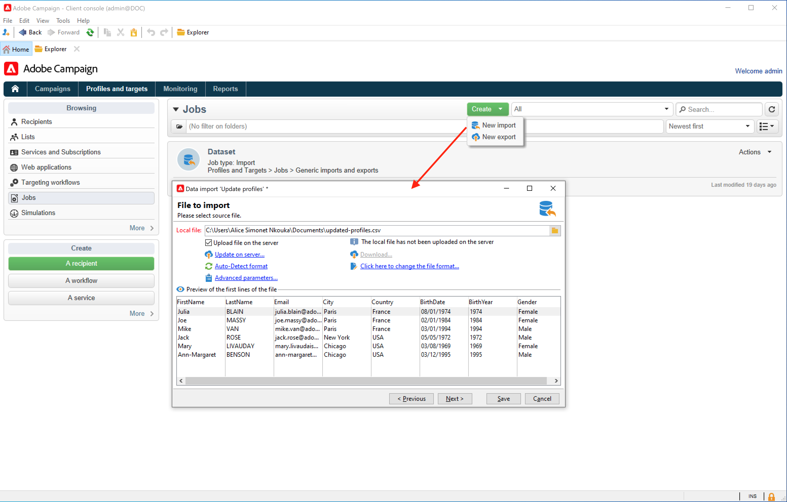

# Gegevens importeren in campagne {#ootb-profiles}

Met de campagne kunt u contactpersonen toevoegen aan de Cloud-database. U kunt een dossier laden, veelvoudige contactupdates plannen en automatiseren, gegevens op het Web verzamelen, of profielinformatie direct in de ontvankelijke lijst ingaan.

 Aan de slag met [publiek](audiences.md)

 Campagne begrijpen [datamodel](../dev/datamodel.md)

## Profielen importeren in een workflow

De invoer van het profiel wordt gevormd in specifieke malplaatjes die door werkschema&#39;s via **Importeren** activiteit. Ze kunnen automatisch volgens een schema worden herhaald, bijvoorbeeld om de gegevensuitwisseling tussen verschillende informatiesystemen te automatiseren. Meer informatie in [Campaign Classic v7-documentatie](https://experienceleague.adobe.com/docs/campaign-classic/using/getting-started/importing-and-exporting-data/import-export-workflows.html){target=&quot;_blank&quot;}.

Meer informatie in de Campaign Classic v7-documentatie:

* [Aan de slag met import en export](https://experienceleague.adobe.com/docs/campaign-classic/using/getting-started/importing-and-exporting-data/get-started-data-import-export.html){target=&quot;_blank&quot;}

* [Beste werkwijzen importeren en exporteren](https://experienceleague.adobe.com/docs/campaign-classic/using/getting-started/importing-and-exporting-data/best-practices/import-export-best-practices.html){target=&quot;_blank&quot;}

* [Importeren configureren en uitvoeren](https://experienceleague.adobe.com/docs/campaign-classic/using/getting-started/importing-and-exporting-data/generic-imports-exports/executing-import-jobs.html){target=&quot;_blank&quot;}

## Eenheidsimporten uitvoeren

Maak en voer een generieke importtaak voor gegevens uit om contactpersonen in de Cloud-database te laden.

 Leer hoe u taken voor unitaire import kunt uitvoeren om uw database te voeden in [Campaign Classic v7-documentatie](https://experienceleague.adobe.com/docs/campaign-classic/using/getting-started/importing-and-exporting-data/generic-imports-exports/about-generic-imports-exports.html){target=&quot;_blank&quot;}.

## Profielen verzamelen via webtoepassingen

Met Campagne kunt u webformulieren maken en profielgegevens eenvoudig en efficiënt verzamelen en beheren. U kunt deze formulieren delen op uw website, zodat uw contactpersonen gemakkelijk hun gegevens kunnen verstrekken. Hun informatie wordt verzonden naar Campagne om hun profiel tot stand te brengen of hun informatie bij te werken als zij reeds in het gegevensbestand aanwezig zijn.

 Leer hoe u webformulieren maakt in [Campaign Classic v7-documentatie](https://experienceleague.adobe.com/docs/campaign-classic/using/designing-content/web-forms/about-web-forms.html){target=&quot;_blank&quot;}.

**Verwante onderwerpen**

* [Soorten publiek maken](audiences.md)
* [Gedupliceerde profielen](https://experienceleague.adobe.com/docs/campaign-classic/using/automating-with-workflows/use-cases/data-management/deduplication-merge.html){target=&quot;_blank&quot;}
* [Profielgegevens vergroten](https://experienceleague.adobe.com/docs/campaign-classic/using/automating-with-workflows/use-cases/data-management/enriching-data.html){target=&quot;_blank&quot;}
