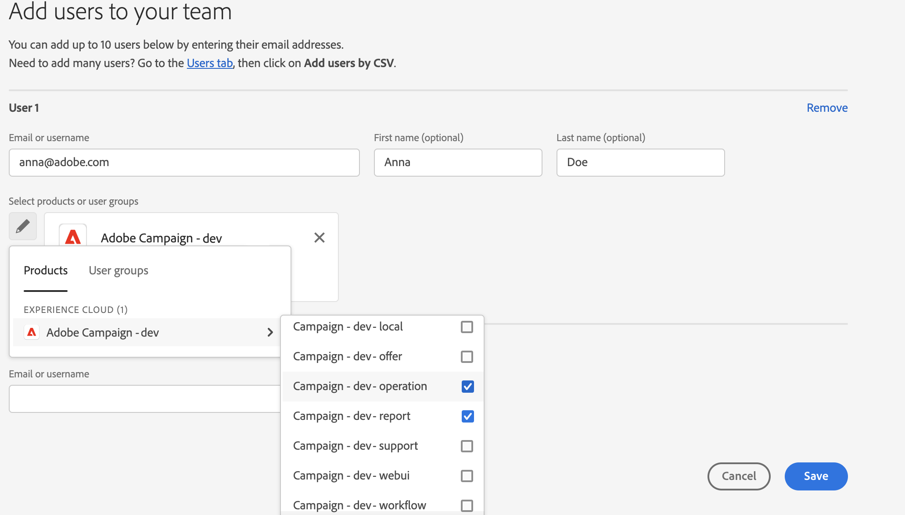

# Gebruikersmachtigingen beheren{#manage-permissions}

## Gebruikers toevoegen {#add-users}

Als productbeheerder, kunt u gebruikers toevoegen en toegang tot Campagne verlenen.

Volg onderstaande stappen om een gebruiker toe te voegen:

1. In de [Admin Console](https://adminconsole.adobe.com/enterprise){target="_blank"} homepage, selecteren **Gebruikers toevoegen**.

   

1. Voer het e-mailadres van de gebruiker in.
1. Gebruik het plusteken (+) om de productprofielen of gebruikersgroepen te selecteren die aan de gebruiker moeten worden toegewezen.

   

   Ingebouwde productprofielen voor campagnes worden weergegeven in [deze sectie](#ootb-productprofiles).

   Leer hoe u gebruikersgroepen kunt maken in [deze sectie](#user-groups)

1. Klikken **Opslaan**. De gebruiker wordt toegevoegd en wordt weergegeven in de lijst Gebruikers. Als u een beheerdersrol of een productprofiel aan gebruikers toewijst, ontvangen zij een e-mailbericht. Gebruikers moeten de koppeling volgen om hun profiel te voltooien.

Meer informatie over het maken van gebruikers in de Admin Console in [deze pagina](https://helpx.adobe.com/ie/enterprise/using/manage-users-individually.html){target="_blank"}.

Wanneer nieuwe gebruikers [aanmelden bij campagne](connect.md) met hun Adobe ID, worden zij toegevoegd aan de lijst van de exploitanten van de Campagne in de cliëntconsole. Campagneontwikkelaars worden opgeslagen in het dialoogvenster **[!UICONTROL Administration > Access management > Operators]** map van Campaign Explorer.

## Werken met productprofielen{#product-profiles}

Gebruik productprofielen om gebruikers de mogelijkheden te bieden die in het product zijn opgenomen.

* Voor elk product op de Admin Console kunt u een of meer productprofielen maken.
* In elk productprofiel wijst u gebruikers en gebruikersgroepen toe (binnen uw organisatie).
* Wanneer een gebruiker zich aanmeldt met de gegevens die zijn opgegeven in het productprofiel, krijgt hij toegang tot de apps en services van het product waarop het productprofiel is gebaseerd.

Deze productprofielen komen overeen met de groepen met operatoren die zijn opgeslagen in het dialoogvenster **[!UICONTROL Administration > Access management > Operator groups]** map van Campaign Explorer.

In de Admin Console gebruiken de productprofielen de volgende syntaxis:

campagne - `<your instance>` - interne naam van de exploitantgroep

Bijvoorbeeld voor **Leveringsoperator** in het &#39;test&#39;-exemplaar is het productprofiel in de Admin Console:

campagne - test - levering

U kunt standaardproductprofielen gebruiken of nieuwe profielen maken.

### Een productprofiel maken{#create-product-profile}

Om een nieuw productprofiel aan Adobe toe te voegen, moet u het eerst in de cliëntconsole van de Campagne creëren, en dan het toevoegen in de Admin Console.

Volg de onderstaande stappen om bijvoorbeeld een productprofiel voor &#39;revisoren&#39; te maken.

#### De operatorgroep maken in Campagne{#create-op-group}

1. Verbinding maken met Campagne, Verkenner openen en bladeren naar **[!UICONTROL Administration > Access management > Operator groups]**.
1. Klikken **[!UICONTROL New]**en definieert u de naam van de operatorgroep en stelt u de interne naam ervan in (&#39;controleurs&#39;).
   
1. Definieer de bijbehorende machtigingen door benoemde rechten te selecteren. Benoemde rechten worden gedetailleerd in [deze sectie](#use-named-rights)
1. Sla de nieuwe operatorgroep op.

#### Het productprofiel maken in de Admin Console{#create-profile-in-admin-console}

1. Verbinding maken met de [Admin Console](https://adminconsole.adobe.com/enterprise){target="_blank"}.
1. Van de **Product en services** sectie van de homepage, open product van de Campagne.
1. Klikken **Nieuw profiel** en voert u de naam in van het productprofiel dat u wilt maken, met de juiste syntaxis zoals uitgelegd [hier](#product-profiles). Voor ons voorbeeld voeren we de campagne - `<your-instance-name>` - controleurs

   

1. Sla uw wijzigingen op.

U kunt nu gebruikers toevoegen aan dit nieuwe productprofiel, zoals wordt uitgelegd in [deze sectie](#add-users).

U kunt productprofielen het beste aan gebruikersgroepen toewijzen. Het beheren van machtigingen door gebruikers is geen duurzaam model.

### Standaardproductprofielen en groepen met operatoren {#ootb-productprofiles}

Adobe Campaign wordt geleverd met ingebouwde **productprofielen** die worden gedefinieerd wanneer de Adobe uw omgeving activeert.

Deze productprofielen komen overeen met de campagne **groepen met operatoren**. De standaardoperatorgroepen en hun [benoemde rechten](#use-named-rights) worden hieronder weergegeven:

1. **[!UICONTROL Administrator]** (beheerder)

   De operatoren in deze groep hebben volledige toegang tot het exemplaar. Beheerders zijn gebruikers die toegang hebben tot de meest technische onderdelen van de gebruikersinterface.

   Deze groep bevat het volgende benoemde recht:

   * **[!UICONTROL ADMINISTRATION]**: recht om objecten zoals workflow, levering, scripts, enz. uit te voeren, te maken, te bewerken/te verwijderen.

1. **[!UICONTROL Delivery operators]** (levering)

   De operatoren in deze groep zijn verantwoordelijk voor het beheer van de leveringen: zij bieden toegang tot de belangrijkste bronnen die nodig zijn voor het maken en voorbereiden van de leveringen (campagneretypologieën, leveringstoewijzingen, standaardsjablonen, aanpassingsblokken, enz.).

   Deze groep bevat de volgende benoemde rechten:

   * **[!UICONTROL PREPARE DELIVERIES]**: recht om de leveringsanalyse te maken, te bewerken en te starten,
   * **[!UICONTROL START DELIVERIES]**: recht om eerder geanalyseerde leveringen goed te keuren.

1. **[!UICONTROL Campaign managers]** (bewerking)

   De exploitanten in deze groep kunnen marketing campagnes beheren: het laat u tot de voorwerpen toegang hebben verbonden aan campagnes (plannen, programma&#39;s, werkschema&#39;s, begrotingen, etc.) in het kader van **[!UICONTROL Campaign]** (optionele Adobe Campaign-module).

   Deze groep bevat de volgende benoemde rechten:

   * **[!UICONTROL INSERT FOLDERS]**: recht om mappen in te voegen in de Adobe Campaign-structuur (op voorwaarde dat u bewerkingsrechten hebt voor de betrokken vertakkingen),
   * **[!UICONTROL WORKFLOW]**: recht om workflows te gebruiken.

   >[!NOTE]
   >
   >Met deze groep kunnen operatoren geen leveringen starten.

1. **[!UICONTROL Content contributors]** (inhoud)

   Gebruikers in deze groep hebben in de context van de **[!UICONTROL Content management]** invoegtoepassing. Deze groep verleent geen extra toestemmingen.

1. **[!UICONTROL Access to reports]** (rapport)

   Deze groep is gereserveerd voor externe operatoren, die via een [Webtoegang](../start/campaign-ui.md#web-browser).

1. **[!UICONTROL Workflow execution]** (workflow)

   De **[!UICONTROL Workflow execution]** Met deze groep kunt u de uitvoering en goedkeuring van doelworkflows beheren: de WORKFLOW met de naam right wordt toegewezen aan de operatoren van deze groep. Dit is vereist voor alle handelingen met betrekking tot workflows, naast toegangsrechten tot de gegevensbestanden. Standaard worden de **[!UICONTROL Workflow execution]** Deze groep heeft alleen-lezen toegang tot standaard doelworkflowbestanden en werkstroomsjablonen. Operatoren in deze groep hebben ook lees- en schrijftoegang tot het goedkeuringsbestand dat in behandeling is.

1. **[!UICONTROL Workflow supervisors]** (workflowSupervisor)

   Gebruikers in deze groep beheren workflowgoedkeuringen en ontvangen een e-mailbericht in geval van waarschuwingen over workflows voor campagnes.

1. **Lokaal/centraal beheer** (centraal / lokaal)

   Gebruikers in deze groep kunnen **[!UICONTROL Distributed marketing]** invoegtoepassing.

1. **[!UICONTROL Offer managers]** (voorstel)

   De exploitanten in deze groep kunnen aanbiedingen tot stand brengen en handhaven wanneer het gebruiken van de toe:voegen-op van de Interactie. [Meer informatie](../interaction/interaction-operators.md).

   Deze groep bevat de volgende benoemde rechten:

   * **[!UICONTROL INSERT FOLDERS]**: Recht om mappen in te voegen in de Adobe Campaign-structuur (op voorwaarde dat u bewerkrechten hebt voor de betrokken vertakkingen),
   * **[!UICONTROL EDIT FOLDERS]**: Recht om mapeigenschappen zoals interne naam, label, gekoppelde afbeelding, volgorde van submappen, enz. te wijzigen.

   De toestemmingen die aan de managers van de Aanbieding worden toegewezen laten hen toe om de volgende taken uit te voeren:

   * Wijzigen **[!UICONTROL Design]** omgevingen.
   * Weergave **[!UICONTROL Live]** omgevingen.
   * Configureer beheerfuncties (vooraf gedefinieerde spaties en filters).
   * Categorieën maken en bijwerken
   * Maak voorstellen.
   * Geschiktheid van aanbieding configureren.
   * Voorstellen goedkeuren.

   >[!NOTE]
   >
   >**Aanbiedingsmanagers** kan een aanbieding alleen goedkeuren als er geen controleur is opgegeven of als deze in de aanbiedingstemplate als controleurs is ingesteld.

   De machtigingsmatrix van de aanbodmanager per omgeving is beschikbaar in [deze pagina](../interaction/interaction-operators.md#recap-of-rights-according-to-operator).

## Werken met gebruikersgroepen{#user-groups}

U kunt de Admin Console gebruiken om gebruikersgroepen te creëren en gebruikers aan hen toe te wijzen.

Een gebruikersgroep is een inzameling van verschillende gebruikers die een gedeelde reeks toestemmingen moeten worden gegeven. Leer hoe u gebruikersgroepen kunt maken in [deze sectie](https://helpx.adobe.com/ie/enterprise/using/user-groups.html){target="_blank"}.

U kunt productprofielen toewijzen aan gebruikersgroepen. Alle gebruikers in die groep ontvangen dus dezelfde set productmachtigingen.

## Benoemde rechten{#use-named-rights}

Adobe Campaign wordt geleverd met een reeks benoemde rechten waarmee u de machtigingen kunt definiëren die aan gebruikers en groepen gebruikers zijn toegewezen. Deze rechten kunnen worden bewerkt via de **[!UICONTROL Administration > Access management > Named rights]** map van Campaign Explorer.

Rechten verlenen machtigingen aan:

* Voer bijvoorbeeld bewerkingen uit op de knop **Analyseren** in de Editor voor levering wordt geactiveerd voor leden van de **Leveringsoperator** groep met de **Levering voorbereiden** Benoemd rechts

* De toegang tot omslagen Lidmaatschap van de Groepen van de Exploitant kan toegangsrechten tot omslagen verlenen of beperken, door de veiligheidsmontages op omslagen te veranderen. [Meer informatie](folder-permissions.md#restrict-access-to-a-folder).

  Het kan bijvoorbeeld invloed hebben op: **Schrijftoegang** nieuwe entiteiten te creëren (zoals leveringen, profielen, enz.); **Leestoegang** entiteiten te gebruiken; **Toegang verwijderen** entiteiten verwijderen.

Standaard benoemde rechten in Adobe Campaign zijn:

* **[!UICONTROL ADMINISTRATION]**: Operatoren met de **[!UICONTROL ADMINISTRATION]** het recht heeft volledige toegang tot het gerecht . Beheerders kunnen elk object, zoals workflow, levering, scripts, enzovoort, uitvoeren, maken, bewerken of verwijderen.

* **[!UICONTROL APPROVAL ADMINISTRATION]**: U kunt meerdere goedkeuringsstappen instellen in workflows en leveringen om ervoor te zorgen dat de huidige status is goedgekeurd door een toegewezen operator of groep. Gebruikers met de **[!UICONTROL APPROVAL ADMINISTRATION]** met recht kunnen goedkeuringsstappen worden ingesteld en kan ook een exploitant of een groep van exploitanten worden toegewezen die deze stappen moeten goedkeuren.

* **[!UICONTROL CENTRAL]**: Recht op centraal beheer (Distributed Marketing).

* **[!UICONTROL DELETE FOLDER]**: Rechts om mappen te verwijderen. Met dit recht kunnen gebruikers mappen verwijderen uit de verkennerweergave.

* **[!UICONTROL EDIT FOLDERS]**: Recht om mapeigenschappen zoals interne naam, label, gekoppelde afbeelding, volgorde van submappen, enz. te wijzigen.

* **[!UICONTROL EXPORT]**: Gebruikers kunnen gegevens uit hun Adobe Campaign-instanties naar een bestand op een server of lokale computer exporteren met de opdracht **[!UICONTROL EXPORT]** workflowactiviteit.

* **[!UICONTROL FILES ACCESS]**: Recht om toegang voor bestanden te lezen en te schrijven via een script dat in het dialoogvenster **[!UICONTROL JavaScript]** workflowactiviteit voor het lezen/schrijven van bestanden op een server.

* **[!UICONTROL IMPORT]**: Recht op het importeren van generieke gegevens. **[!UICONTROL IMPORT]** kunt u gegevens in een andere tabel importeren, terwijl de optie **[!UICONTROL RECIPIENT IMPORT]** Met right kunt u alleen importeren in de tabel voor ontvangers.

* **[!UICONTROL INSERT FOLDERS]**: Rechts om mappen in te voegen. Gebruikers met de **[!UICONTROL INSERT FOLDERS]** Met de rechtermuisknop kunt u nieuwe mappen maken in de mappenstructuur in de weergave Verkenner.

* **[!UICONTROL LOCAL]**: Recht voor lokaal beheer (Distributed Marketing).

* **[!UICONTROL MERGE]**: Rechts om de geselecteerde records samen te voegen tot één record. Als ontvangers bestaan als duplicaten, worden de **[!UICONTROL MERGE]** Met de rechtermuisknop kan de gebruiker de duplicaten selecteren en deze samenvoegen in een primaire ontvanger.

* **[!UICONTROL PREPARE DELIVERIES]**: Recht om een levering te maken, bewerken en opslaan. Gebruikers met de **[!UICONTROL PREPARE DELIVERIES]** het recht kan ook het proces van de leveringsanalyse starten .

* **[!UICONTROL PRIVACY DATA RIGHT]**: Recht om privacygegevens te verzamelen en te verwijderen. [Meer informatie](privacy.md).

* **[!UICONTROL PROGRAM EXECUTION]**: Recht om opdrachten uit te voeren in verschillende programmeertalen.

* **[!UICONTROL RECIPIENT IMPORT]**: Recht op het importeren van ontvangers. Gebruikers met de **[!UICONTROL RECIPIENT IMPORT]** Met de rechtermuisknop kunt u een lokaal bestand importeren in de ontvangende tabel.

* **[!UICONTROL SQL SCRIPT EXECUTION]** Recht om het even welk SQL bevel direct op het gegevensbestand uit te voeren.

* **[!UICONTROL START DELIVERIES]**: Recht om eerder geanalyseerde leveringen goed te keuren. Na de afleveringsanalyse wordt de levering onderbroken in verschillende goedkeuringsstappen en moet deze worden goedgekeurd om te worden hervat. Gebruikers met de **[!UICONTROL START DELIVERIES]** het recht heeft leveringen goed te keuren.

* **[!UICONTROL USE SQL DATA MANAGEMENT ACTIVITY]**: Recht om uw eigen SQL manuscripten te schrijven gebruikend de SQL activiteit van het Beheer van Gegevens, om het werklijsten tot stand te brengen en te bevolken. [Meer informatie](../../automation/workflow/sql-data-management.md).

* **[!UICONTROL WORKFLOW]**: Dit genoemde recht is specifiek voor workflows: u kunt workflows maken, starten en stoppen. Het genoemde recht is alleen van toepassing als het workflowbestand leesrechten bevat. Voor doelgerichte workflows kunt u de leesvolgorde op de knop **[!UICONTROL Profiles and Targets]** is vereist.

* **[!UICONTROL WEBAPP]**: Recht om webtoepassingen te gebruiken.

>[!NOTE]
>
>Deze lijst kan verschillen, afhankelijk van de invoegtoepassingen die op uw omgeving zijn geïnstalleerd.

## Verdere bronnen{#additional-res}

* [Machtigingen voor workflows beheren](../../automation/workflow/managing-rights.md)
* [Rechten voor gedistribueerde marketing beheren](../../automation/distributed-marketing/about-distributed-marketing.md#operators)
* [Rechten voor de interactiemodule beheren](../interaction/interaction-operators.md)
* [Toegang tot schema&#39;s filteren](../dev/filter-schema.md)
* [PI-weergave beperken](../dev/restrict-pi-view.md)
